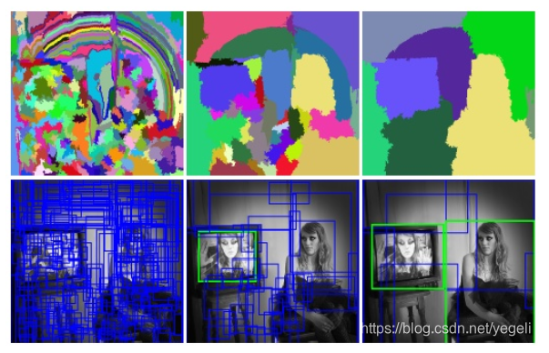

参加了一个目标检测比赛，由于之前从未接触过目标检测，在此记录一些比赛所需知识点。

## 一、目标检测的定义

目标检测是cv任务中的一种，其目的在于找到图像中目标的位置(用框框出)，并对其分类(识别它是什么)。因此目标检测是分类、回归问题的叠加。

## 二、经典算法

基于深度学习的目标检测算法可以分为Two stage和One stage.

1. Two stage:

   先生成预选区域，称之为**Region Proposal(RP)**。再通过CNN对预选区域进行分类。

   > 常见算法(R-CNN系): R-CNN、SPP-Net、Fast R-CNN、Faster R-CNN和R-FCN等。

2. One stage:

   不生成RP，直接再网络中提取特征来预测物体的位置和类别。

   > 常见算法(YOLO系): OverFeat、YOLOv1、YOLOv2、YOLOv3、SSD和RetinaNet等。

## 三、算法细节

### RP的生成

**1.滑动窗口法**

对输入图像进行不同大小的窗口从左到右、从上到下的滑动。每次滑动对当前窗口分类（用训练好的分类器），如果得到较高的分类概率，则认为检测到了物体。对窗口和位置遍历之后，会得到不同窗口检测到的物体标记，这些窗口中会存在重复较高的部分，最后采用非极大值抑制(Non-maximum Suppression, NMS)的方法筛选，会得到检测到的物体。

滑窗法效率低下，且窗口的长宽比固定，对于实时性要求较高的分类任务并不推荐。

**2.选择性搜索**

选择搜索(Selective Search)首先用**分割算法**将图像分割成不同的小区域，再根据子区域之间的相似性（颜色，纹理，大小等）进行区域合并。每次合并过程对合并后的区域做外切矩形(bounding boxes)，即候选区域RP。

### 数据表示

找到RP后，用**x,y,w,h**分别表示其中心在图像的**横坐标、纵坐标、框的宽度、框的高度**。一张RP标记过的图片，模型输出可以表示为:$[p,x,y,w,h,c0,c1,c2]$,$p$为预测结果的置信概率，$c0,c1,c2$为三个类别的分类概率。

根据此输出构建的损失函数包含分类和回归两个部分。

>注：数据标注(annotations)有三种不同的格式：YOLO，COCO，VOC。注意格式转换。

### 效果评估

使用交并比(Intersection over Union, IoU)来判断模型好坏。IoU指的是预测边框和实际边框**交集面积/并集面积**，一般约定0.5为有效的值。

**非极大值抑制(NMS)**

预测结果中可能多个结果有重叠部分，保留IoU最大的结果。

## 四、目标检测模型

### R-CNN系列

**R-CNN(Regions with CNN features):**

1. 用SS等机器学习方法提取RP（约2k张），resize/wrap成分类CNN所需的固定大小。
2. 选择预训练的CNN，用训练集(已经标好框分好类的图)重新训练全连接层。
3. 将**所有RP**送入CNN得到一系列feature maps，保存到本地。
4. 利用feature map训练**SVM**来对目标和背景进行分类。
5. 利用feature map训练回归分类器来矫正边框。

**Fast R-CNN:** 一次特征提取

1. 生成RP
2. 训练CNN
3. 将**原图**输入CNN，得到feature map。对每个RP，找到其在feature map中对应位置，截取出feature box保存。
4. 将每个feature box划为7x7的网格，每个网格最大池化，得到大小均7x7xC的feature box
5. 将feature boxes输入全连接层，全连接层同时进行分类和回归。

**Faster RCNN:** 用RPN提取RP

1. 用Conv layers提取出feature map
2. feature map输入RPN(Region Proposal Networks)生成RP，并用回归矫正边框
3. RoI Pooling基于feature map和bboxes提取feature box
4. feature box送入全连接层分类，并再次回归矫正边框。

### YOLO系列

YOLO(You Only Look Once)

## 五、评测指标

#### **基础概念**

mAP: mean Average Precision, 各类别AP的均值。

AP: PR曲线下面积

PR曲线: Precision-Recall曲线

Precision: TP/(TP+FP)

Recall: TP/(TP+FN)

TP: IoU>0.5的检测框数量

FP: IoU<=0.5的检测框/同一个目标多余检测框的数量

FN: 没有检测到的目标的数量

#### **mAP计算**

**COCO数据集**：设定多个IoU阈值(0.5-0.95,步长0.05),每个阈值下有一个mAP，多个mAP平均。

**计算某个类AP**：计算该类下每张图片的TP,FP,FN个数，画出PR曲线

**判断TP,FP,FN**：

- 遍历图片中的对象，提取我们计算的类别的对象。
- 读取判断为该类别的检测框，过滤掉分类置信度低于阈值(score_thr)的框。
- 将剩余框按置信度高到低排序，按顺序判断框IoU是否大于IoU阈值。
- 若大于则当前框标为TP，该目标标为已检测，剩余对该目标的检测框的都标为FP。(NMS)
- 若小于则当前框标为FP。

**mAP与NMS**：

测试时才会进行NMS操作(训练时需要大量负样本)，进行NMS之后再计算mAP。

也就是说纯训练过程是没有计算map的，模型输出的就是对同一个目标满足阈值的很多框框。根据这些框框来通过各种方法选取最终需要的框，如NMS，WBF(融合各个框)等，当然也可以融合多个模型的对同一个目标的框框。

> 其余精度指标参见[精度指标]()

