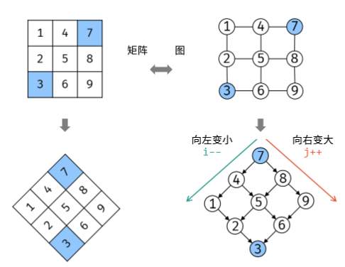

# Array

Array is a data structure that O(1) when search, O(n) when insert.

## Basic syntax

### create/del a list

```python
l = []
l = list()

del l
```

### operations

```python
## slice
l[beg:end:step]   # when step <0, beg need to > end.

# inplace operations, returns None!!
l.append()
l.extend()   # input is sequence, so "a" is ok, but 3 is not.
l.reverse()  # l[::-1], return None
l.pop() # delete the last number

### bisect
# for a orderred list l, we can use py3 built-in binary select function.
i = bisect_left(l,x) # the first index >= x
j = bisect_right(l,x) # the first index > x
# eg1, l=[1,5,9], x=7 -> i=j=2
# eg1.1, l=[1,5,9], x=10 -> i=j=3
## -> x not in l, returns appropriate insert position
# eg2, l=[1,5,9], x=9 -> i=2, j=3
# eg3, l=[1,5,5,9], x=5 -> i=1,j=3
bisect_left(l,x,begin,end,key = lambda x: x[1]) # [begin, end)
```

## Problems

### 1. Binary Search

> [704. Binary Search](https://leetcode.com/problems/binary-search/description/) sorted **unique** numbers

#### Details need to remember:

- **Initializing boundary** needs to cover all elements: `l=0, r=length-1`

- **Calculating mid** needs to consider integer overflow

  ```python
  mid = (l+r)//2  # very easy to overflow
  mid = l + (r-l)//2  # better, but still possible
  mid = (l+r) >> 1  # the best
  ```

- **Pick left `mid` or right `mid`** (according to the different if...else condition)

  ```python
  mid = (l+r) >> 1  # left mid
  mid = (l+r+1) >> 1  # right mid
  ```

  it depends on how you write the ```if ... else```.

  Just imagine there are only 2 elements left, and the procedure falls into the 'else block'. The wrong mid will result in an infinite loop because neither `l` nor `r` makes a move. You need to make sure that each move shrinks the `r-l`.

  **left mid with > condition(target falls into right half)**

  ```python
  mid = (l+r) >> 1
  
  if target > nums[mid]:
      l = mid + 1  # mid is not the answer
  else:
      r = mid  # mid might be the answer
  ```

  **after exit:** `l==r` and returns the index that its value >= the target -> except for target lying in the right of the list.

  Left mid uses `l` to get close to the target(`l=mid+1`). If the target doesn't exist in the list, the pointers both stop at the first number bigger than it.

  0 1 2 3 4 5, target: 2.5, `l==r==3`; target: 6, `l==r==5`

  **right mid with < condition(target falls into left half)**

  ```python
  mid = (l+r+1) >> 1
  
  if target < nums[mid]:
      r = mid - 1
  else:
      l = mid
  ```

  **after exit:** `l==r` and returns the index that its value <= the target -> except for target lying in the left of the list.

  Right mid uses `r` to get close to the target(`r=mid-1`). If the target doesn't exist in the list, the pointers both stop at the last number smaller than it.

  0 1 2 3 4 5, target: 2.5, `l==r==2`; target: -1, `l==r==0`

- **While loop**

  ```python
  while(l<r):
      ...
  return l if nums[l]==target else -1
  ```

  **after exit:** the list is empty -> `l > r`; non-empty -> `l==r`

> [34. First and last index](https://leetcode.com/problems/find-first-and-last-position-of-element-in-sorted-array/) sorted **nonunique** numbers

When the numbers are non-unique, the exit condition changes a little:

​	0 1 2 3 3 3 4 , target: 3

- **left mid**: when hit the target number, `r` will keep moving left until meets `l`

  **exit condition:** if target in the list, `l==r==the first target num index`

- **right mid:** when hit the target number, `l` will keep moving right until meets `r`

  **exit condition:** if target in the list,`l==r==the last target num index`

> [274. H-Index](https://leetcode.com/problems/h-index/)

- Solution 1: sort reversely then count, $O(nlogn), O(n)$

- Solution 2: construct hash map to record the number of papers that cited i times.

- Solution 3: Binary search.

  - As the h-index ranges from 0 to n. We can do the binary search to find the correct h-index.

  - left mid or right mid? 

    - When we compute a mid, we assume it is the current h-index. Then we iterate citations to count the number of papers that cited >= mid times. 

    - When the cnt >= mid, the final h-index could > mid and could also = mid. 

    - When the cnt < mid, the final h-index is definitely < mid.

    - So the if else loop should be:

      ```python
      if cnt < mid:
          r = mid - 1
      else:
          l = mid
      ```

      That is a right mid formula. So `mid = (l+r+1)>>1`

### 2. Two pointers

In summary, two pointers method is used for:

1. Cutting down a `'for loop'`, from $O(n^2)$ to $O(n)$.
2. Needing one pointer as index, another to process elements -> same direction
3. Convenient to process together of head and end -> opposite direction

Tips:

1. We can process from right to the left (especially when having vacancies in the right part of the array). -> finishing the task in one iteration.

> [27. Remove Element](https://leetcode.com/problems/remove-element/description/)

- Two pointers walk in the **same direction**: the slow one to keep the result list, the fast one to iterate the list.
- Two pointers walk in the **opposite direction**: left for searching in sequence, right for picking the element to replace.

> [238. Product of Array Except Self](https://leetcode.com/problems/product-of-array-except-self/)

We can record the product of the prefix and suffix in the ans[], and calculate the ans in the same time.

- We use l, r pointers walking in the opposite direction. 
  - Fill ans with 1.
  - When they haven't meet, the ans[l] means the product of prefix 0~l-1; ans[r] means the product of suffix r+1~n-1.
  - When they meet and surpass each other, the ans[l] is not 1 anymore. It means the product of suffix l+1~n-1. We can get the correct ans by multiplying it with the currently accumulated product of prefix. Likewise, ans[r] is updated in the same way.

> [11. Container With Most Water](https://leetcode.com/problems/container-with-most-water/)

A bit like problem 84. In this problem, we can use two pointers l, r to represent the left and right boundary. When shrink the boundary, it is always better to move the shorter one.

> [42. Trapping Rain Water](https://leetcode.com/problems/trapping-rain-water/)

Also, we set left and right pointers. In the mean time, we keep the lmax, rmax to record the current max height of left part and right part during moving.

We judge the shorter one between lmax and rmax, because the longer one can definitely help trap the water. Assume currently the shorter one is lmax, then the trapped water on the l index should be `lmax-h[l]`.

### 3. Sliding Window

> [209. minimum size subarray sum](https://leetcode.com/problems/minimum-size-subarray-sum/)

- l and r move in the **same direction **(start at the same place).
- while r explore for a bigger sum, l moves to shrink the window size.

```python
# template for sliding windows
left = 0, right = 0;

while (left < right && right < s.size()) {
    # pre processing
    xxx
    # expand the right boundary
    window.add(s[right]);
    right++;
    # shrink the left boundary
    while (window needs shrink) {
        # shrink the window
        window.remove(s[left]);
        left++;
    }
}
```

### 4. Rotate Array

> [189. Rotate Array](https://leetcode.com/problems/rotate-array/)

- Solution 1: construct an additional list.
- Solution 2: reverse the array from 0 to n. Then reverse nums[:k] and nums[k:].
- Solution 3: use a temp variable to record the next replaced number. Replacing the numbers with a step size of k and in a circular manner.

### 5. Moore Voting Algorithm(find majority)

> [169. Majority Element](https://leetcode.com/problems/majority-element/)

If there is a majority element in an array, it will always remain in the lead, even after encountering other elements.

We pick a temporary majority (`candidate`) first. Each time we meet the same candidate, we increase the count by 1. Else we decrease by 1. Once the count reach to 0, we assign the current num as the new candidate.

```python
candidate, count = 0, 0
for num in nums:
    if count == 0:
        candidate = num
        count += 1 if num == candidate else -1
return candidate
```

### 6. Inplace Operation on array

> [41. First Missing Positive](https://leetcode.com/problems/first-missing-positive/)

$O(n),O(1)$

We can do inplace operations on the input nums array to avoid space complexity. Notice that the first missing positive can either be in [1,n] or equal to n+1.

**Solution 1:**

We modify the nums as a hashmap: nums[i] means whether the i+1 num in nums.

- Traverse once to select the numbers that <=0 and >n. These numbers don't affect our results. -> **Modify them to the value of n+1.**
- Traverse again to tag the nums[i] that have i+1 in original nums. -> When ever meet a num in [1,n] or [-n,-1], **modify nums[num-1] to -abs(nums[num-1])**.
- Traverse third time to select the first positive nums[i], return i+1 if there is, else return n+1.

**Solution 2:**

We change the numbers in [1,n] to the correct position num-1. The first i that nums[i] != i+1 would be the positive. Otherwise n+1 would be the positive.

- How to change? swap the current num1 and the num2 on its correct position. Continue swap num2 with num3 and so on.
- What if two nums are equal? Stop the swap loop and move to the next i. The excessive one would finally be placed on the position that we need to return.

### 7. Matrix

> [54. Spiral Matrix](https://leetcode.com/problems/spiral-matrix/)

Keep left, right, top, bottom as the current boundaries. For each loop, we traverse the left->right, top->bottom, right->left, bottom->top and modify the possible left,right,top,bottom.

> [48. Rotate Image](https://leetcode.com/problems/rotate-image/)

**Solution 1: Split blocks**

`Rotating the matrix is equal to rotating blocks in a circle.`


Generally, for element at `(row,col)`, after rotation, it should moves to `(col,n-1-row)`. We have the equation $M(c,n-1-r)=M(r,c)$. Continually, we have the following four equations that split the Matrix into four groups.


**Solution2: Flip horizontally and along the main diagnol**

- Step1: swap row[i] and row[n-1-i] for i in range(n//2).
- Step2: swap `M[i][j]` and `M[j][i]`.

> [240. Search a 2D Matrix II](https://leetcode.com/problems/search-a-2d-matrix-ii/)

**Solution1: binary search on each row** -> $O(mlogn)$

**Solution2: Z-search / Binary search tree** -> $O(m+n)$

- So we can search from the top right num.




## Sort algorithm

### Quick sort -> $O(nlogn),O(n)$

Select a pivot to put smaller number left to it and bigger number right to it.

1. pick a pivot -> `random index`

2. two pointers l and r moving in the oppose direction, making the left part smaller than pivot and the right part bigger.

3. swap a[l] and a[r], return the index of where it is partitioned.

**Attention:**

- It is not stable. -> the sequence of same elements is not fixed.

- If a is sorted, index == l will result in $O(n^2)$, so random index is needed.
- If there are many repeated nums, line 7-8 can not be >= and <=. If so, the partitioned sub-arrays are always one longer than another. eg. 1,2,2,2,2,2|4,7,5

```python
def quicksort(a,l,r):
    if l >= r: return
    index = random.randint(l,r)  # [l,r]
    pivot = a[index]
    i, j = l, r
    while i <= j:   # Attention
        while a[j] > pivot: j -= 1   # can not include equal.
        while a[i] < pivot: i += 1   # can not include equal.
        if i > j: break              # Attention
        a[i], a[j] = a[j], a[i]
        j -= 1    # prevent j stuck at the pivot num.
        i += 1    # prevent i stuck at the pivot num.
    quicksort(a,l,i-1)
    quicksort(a,i,r)
```

### Merge Sort -> $O(nlogn),O(n)$

Divide the array into two halves, sort each half, and then merge the sorted halves back together.

- Stable

```python
def mergesort(a,l,r):
    if l >= r:
        return
   	mid = (l+r)>>1
    mergesort(a,l,mid)
    mergesort(a,mid+1,r)
   	# merge two sorted sub-array
    i, j = l, mid+1
    temp = []
    while i <= mid and j <= r:
        if a[i] <= a[j]:
            temp.append(a[i])
            i += 1
        else:
            temp.append(a[j])
            j += 1
    temp += a[i:mid+1]
    temp += a[j:r+1]
    a[l:r+1] = temp
```

### Heap Sort -> $O(nlogn), O(1)$

- not stable.

**Heap**: for each node, its value is alway bigger/smaller than its sons' value.

- **Create a heap $O(n)$:** create a binary tree and heapify it.

- **heapify** $O(n)$: start from bottom-right node. Compare the sons and the father node, swap the biggest among them with father node. If swap lson and father, continuely check whether lson is bigger than its sons.
- **heap pop $O(logn)$**: Remove the root and move the bottom right node to the root. Check whether new root is the biggest, if not, adjust to the bottom.

We don't need to build a binary tree actually. We can manipulate the corresponding indexes.

```python
def heapify(a,i,end):
    j = 2*i+1 # lson
    while j <= end:
        if j+1 <= end and a[j+1] > a[j]:
            j += 1
        if a[i] < a[j]:
            a[i], a[j] = a[j], a[i]
            i = j
            j = 2*i+1
        else:
            break # don't need to swap -> already a heap

n = len(a)
# create heap: from the last non-leaf node to root
for i in range(n//2-1,-1,-1):
    heapify(a,i,n-1)
# heap pop: sway the root(maxval) to the list tail
for j in range(n-1,-1,-1):
    a[0], a[j] = a[j], a[0]
    heapify(a,0,j-1)
```

