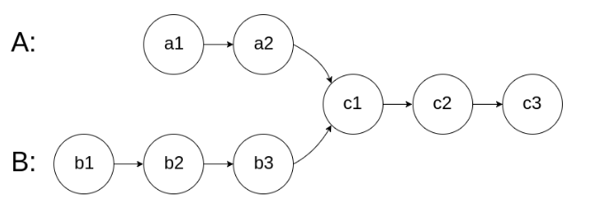

# Linked_List

Linked List is a data structure that O(1) when insert O(n) when search.

There's no index only to search in sequence.

## Delete element

> [203.Remove linked list elements](https://leetcode.com/problems/remove-linked-list-elements/)

- Remember to check the **empty List** and the **empty node** cases.
- Construct a **dummy head** to avoid initial process of head node.
  - usually request a delete process.

## Reverse Linked List

> [206. Reverse Linked List](https://leetcode.com/problems/reverse-linked-list/description/)

#### recursively

- Check the original code for a better understanding.

- Its space complexity depends on the `recurse times (stack nums)` it takes. In 206, it is O(n).

## Two pointers

**Floyd's Cycle-Finding algorithm/Hare-Tortoise algorithm/Fast and slow pointer** -> when they meet, they both goes n(int) rounds of the loop.

> [142. Linked List Cycle 2](https://leetcode.com/problems/linked-list-cycle-ii/description/)

The algorithm works by two pointers, a slow and a fast one. The fast one moves twice as fast as the slow one. 

- If there's a cycle in the linked list, the two pointers will meet inside the cycle. When they meet:
  - define `f` as the distance of the fast pointer has moved, and `s` as that of the slow one.
  - define `a` as the distance before the cycle starts, and `b` as the total distance of the cycle.
  - Therefore, `f=2s` and `f=s+nb`, `n`(int) represents the number of extra rounds fast pointer moved. So `s=nb`, which means the slow pointer exactly moved `n` rounds (`n=a+kb`, k is not int) when they meet. When the slow pointer continue moving `a` distance, it will get to the start of the cycle.
  - So we move the fast pointer to the head after they first met. Then they move the same speed and will secondly meet at the start of the cycle after `a` distance.
- If there's no cycle, the fast pointer will reach the end of the linked list.

> [202. Happy number](https://leetcode.cn/problems/happy-number/description/)

Also a problem of detect cycle(judge whether they meet), just use a series of number instead of linked list.

> [160. Intersection of Two Linked Lists](https://leetcode.com/problems/intersection-of-two-linked-lists/)

Think the condition when the two pointers meet.

- **meet condition**: when intersection, they remain the same distance to go.
- **Method**: find a way to let them reach the intersection at the same time. Pointers with equal speed, let the longer one goes m-n ahead.
  	1. traverse the two linked-list, and calculate the length difference m-n.
   	2. let the two start at the same time, and when `pa` goes to the end, `pb` remains m-n. So let `pa` point to headB, and when `pb` goes to the end, it points to headA. Thus `pa` goes m-n ahead now, and it points to B.

> [19. Remove the nth node from end of list](https://leetcode.com/problems/remove-nth-node-from-end-of-list/)

Keep fast pointer n node ahead of the slow one. When faster pointer arrives at the end, the slow one points at the nth node.