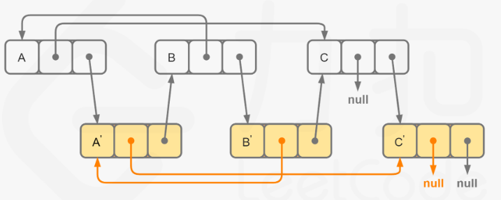

# Linked_List

Linked List is a data structure that O(1) when insert, O(n) when search.

There's no index only to search in sequence. For delete, we need to search first $O(n)$, then delete $O(1)$.

Double linked list: we can query any node from any start node. The deletion doesn't need to search.


## Delete element

> [203.Remove linked list elements](https://leetcode.com/problems/remove-linked-list-elements/)

- Remember to check the **empty List** and the **empty node** cases.
- Construct a **dummy head** to avoid initial process of head node.
  - usually request a delete process.

## Link pointers operation

> [206. Reverse Linked List](https://leetcode.com/problems/reverse-linked-list/description/)

#### recursively

- Check the original code for a better understanding.

- Its space complexity depends on the `recurse times (stack nums)` it takes. In 206, it is O(n).

> [138. Copy List with Random Pointer](https://leetcode.com/problems/copy-list-with-random-pointer/)

**Solution1: Use a map to map ori code to new code, $O(n),O(n)$**

- Thus we can find the node that random points to.

**Solution2: Insert the copied node after the ori node, $O(n), O(1)$**

The random of A' will points at A.random.next.

It is another kind of binding: use A.next to bind A'.




## Two pointers

The Linked-List is hard to acquire the length. So we use two pointers and keep a distance between them.

1. Keep f `n` ahead of s.
2. Keep f-s increment 1 every step -> f=2s.

**Floyd's Cycle-Finding algorithm/Hare-Tortoise algorithm/Fast and slow pointer**

> [142. Linked List Cycle 2](https://leetcode.com/problems/linked-list-cycle-ii/description/)


The algorithm works by two pointers, a slow and a fast one. :one: The fast one moves twice as fast as the slow one. :two: The fast one goes n(int) more rounds than the slow one.

- If there's a cycle in the linked list, the two pointers will meet inside the cycle. (Because each step the distance between f and s increment 1.) When they meet:
  - define `f` as the distance of the fast pointer has moved, and `s` as that of the slow one.
  - define `a` as the distance before the cycle starts, and `b` as the total distance of the cycle.
  - Therefore, `f=2s` and `f=s+nb`, `n`(int) represents the number of extra rounds fast pointer moved. So `s=nb`, which means the slow pointer exactly moved `n` rounds (`n=a+kb`, k is not int) when they meet. When the slow pointer continue moving `a` distance, it will get to the start of the cycle.
  - So we move the fast pointer to the head after they first met. Then they move the same speed and will secondly meet at the start of the cycle after `a` distance.
- If there's no cycle, the fast pointer will reach the end of the linked list.

> [202. Happy number](https://leetcode.cn/problems/happy-number/description/)

Also a problem of detect cycle(judge whether they meet), just use a series of number instead of linked list.

> [160. Intersection of Two Linked Lists](https://leetcode.com/problems/intersection-of-two-linked-lists/) *


Think the condition when the two pointers meet.

- **meet condition**: when intersection, they remain the same distance to go.
- **Method**: find a way to let them reach the intersection at the same time. Pointers with equal speed, let the longer one goes m-n ahead.
  	1. traverse the two linked-list, and calculate the length difference m-n.
   	2. let the two start at the same time, and when `pa` goes to the end, `pb` remains m-n. So let `pa` point to headB, and when `pb` goes to the end, it points to headA. Thus `pa` goes m-n ahead now, and it points to B.

Easier understanding:

len(A)=m, len(B)=n.

If A and B have intersection, pa goes m+n and pb goes m+n. They will meet at the end no matter where they start. Also, the whole c1 c2 c3 they go together. So the node they first meet would be the intersection.

> [19. Remove the nth node from end of list](https://leetcode.com/problems/remove-nth-node-from-end-of-list/)

Keep fast pointer `n node ahead of` the slow one. When faster pointer arrives at the end, the slow one points at the nth node.

> [21. Merge Two Sorted Lists](https://leetcode.com/problems/merge-two-sorted-lists/)

A simpler code: create one dummy head point to the final linked list. Each time we compare the p1.val and p2.val, let dummy head point to the smaller(or equal) one.

## Double linked list

> [146. LRU Cache](https://leetcode.com/problems/lru-cache/)

get and put need to be implemented in $O(1)$ time complexity.

A **double linked list** to add and delete in $O(1)$. A hashmap to map key to the node, so query is in $O(1)$.

Initialization:

```python
class Node:
    def __init__(self, key=0, val=0):
        self.val = val
        self.key = key
        self.pre = None
        self.next = None
class LRUCache:
    def __init__(self, capacity: int):
        self.cache = {}
        self.capacity = capacity
        self.size = 0
        # initialize the dummy head and dummy tail.
        self.head = Node()
        self.tail = Node()
        self.head.next = self.tail
        self.tail.pre = self.head
```

