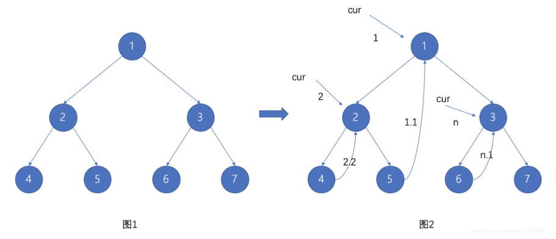
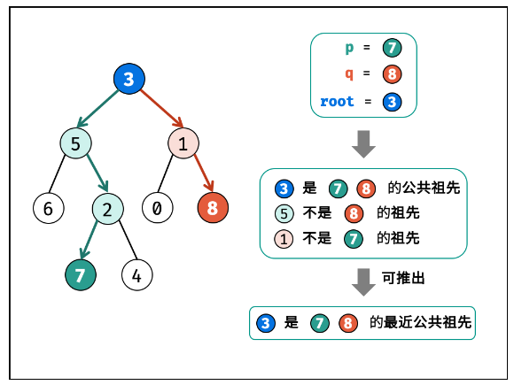
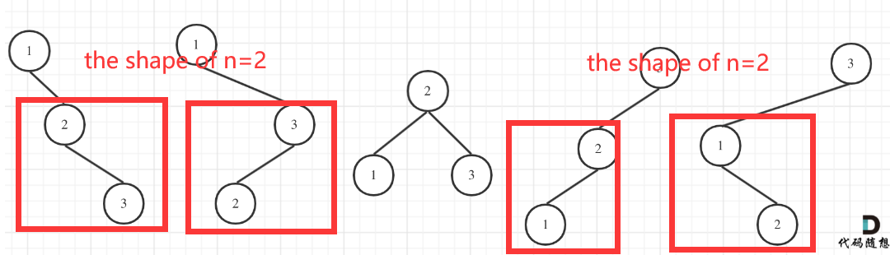

# Binary Tree

Binary tree is a tree structure where each node has `at most` two children nodes. We named them as `left child, right child`. 

- **Full Binary Tree**: the total number of nodes is $2^k-1$ (k is the layer num, start from 1) -> a full triangle

- **Complete Binary Tree:** full binary tree with only the right part of the last layer missed -> $n_0 = \frac{n+1-n_1}{2}$, $n_0$: the num of leaf nodes; $n_1$: the num of nodes with only one child; $n$: the total num of the tree.

## Basic Operations

### Traversal

- **PreOrder**: current-left-right
- **InOrder**: left-current-right
- **PostOrder**: left-right-current
- **LevelOrder**: by level

``` python
## Tree node
class TreeNode:
    def __init__(self, val=0, left=None, right=None):
        self.val = val
        self.left = left
        self.right = right
        
## recursive: all three traversal methods are alike.
## Time complexity: O(n), Space complexity: at most O(n), average O(logn) (==O(height))
def inorderTraversal(root):
    if not root: return []
    ans = []
    ans.extend(self.inorderTraversal(root.left))
    ans.append(root.val)
    ans.extend(self.inorderTraversal(root.right))
    return ans

## iterative: based on stack
## Time complexity: O(n), Space complexity: at most O(n), average O(logn)
def PreOrderTraversal(root):
    if not root: return []
    ans = []
    stack = deque([root])
    while stack:
        node = stack.pop()
        ans.append(node.val)                     # visit current node
        if node.right: stack.append(node.right)  # first push right, last out right
        if node.left: stack.append(node.left)
    return ans
def InOrderTraversal(root):
    if not root: return []
    ans = []
    stack = deque([])
    node = root
    while stack or node:
        while node:
            stack.append(node)
            node = node.left
        node = stack.pop()      # find the most left node.
        ans.append(node.val)    # visit the most left node.
        node = node.right
    return ans
def PostOrderTraversal(root):
    ## version 1
    if not root: return []
    ans = []
    stack = deque([root])
    cur = root
    while stack:
        node = stack[-1]
        # if right is the last visited, left is also visited
        if node.left and node.left != cur and node.right != cur:
            stack.append(node.left)
        elif node.right and node.right != cur:
            stack.append(node.right)
        else:
            ans.append(stack.pop().val)
            cur = node                  # cur means the last visited.
    return ans
	## version 2: left-right-current == reversed(current-right-left)
    if not root: return []
    stack = deque([root])   
    ans = []
    while stack:
        node = stack.pop()
        ans.append(node.val)
        if node.left: stack.append(node.left)
        if node.right: stack.append(node.right)
    return ans.reverse()
## level order -> BFS -> queue
def levelOrder(root):
    if not root: return []
    queue = deque([root])
    ans = []
    while queue:
        size = len(queue)
        level = []
        for i in range(size):
            node = queue.popleft()
            level.append(node.val)
            if node.left: queue.append(node.left)
            if node.right: queue.append(node.right)
        ans.append(level)
    return ans
```

**Morris traversal**:

For each root node, connect its rightest node of the left tree to it.

Time complexity $O(n)$, Space complexity $O(1)$.



```python
def Morris(root):
    if not root: return []
    cur1, cur2 = root, None
    # preOrderAns = []   # appended when 1. one root is first connected 2. the leaf node is added.
    while cur1:
        cur2 = cur1.left
        if cur2:
            while cur2.right and cur2.right != cur1:
                cur2 = cur2.right
            if cur2.right == None:
                cur2.right = cur1
                # preOrderAns.append(cur1.val)
                cur1 = cur1.left
                continue
            else:
                cur2.right = None   # if the root is already connected,
        cur1 = cur1.right            
```


## In total

1. At first, judge the `root==None` condition.

2. Remember to consider the conditions that `node.left == None`, `node.right == None`

   

## Problems

### Process the Binary Tree

The fundamental operations is **Traverse and process**. Pick a traverse method that is easy to process data. Usually pick preOrder(**first process the data then traverse, From top to bottom**) and postOrder(**first traverse then process the data, From bottom to top**). 

The **traverse** tips:

- **From top to bottom**: need to pass the value as param in the function.
- **From bottom to top**: need to gather the returned values of left and right.


The **process** tips:

- Passing two nodes at a time.
- Calculate the height and judge the balance at the same time.

> [101. Symmetric Tree](https://leetcode.com/problems/symmetric-tree/description/)

**DFS: Pass and compare two nodes when in one recursive round**

```python
def isSymmetric(root):
    if not root: return True
    def dfsCompare(l, r):
        if not l and not r: return True  # when l==r==None, return True
        if not l or not r: return False  # when one of nodes is None, return False 
        if l.val != r.val: return False  # when nodes.val are not equal, return False
        # compare the four children.
        return dfsCompare(l.left, r.right) and dfsCompare(l.right, r.left)
    return dfsCompare(root.left, root.right)
```

**BFS: Pop and process two nodes in one iteration**

```python
def isSymmetric(root):
    if not root: return True
    q = deque([root.left, root.right])
    while q:
        l, r = q.popleft(), q.popleft()
        if not l and not r: continue
        if not l or not r: return False
        if l.val != r.val: return False
        ## push in the queue in the corresponding manner.
        q.append(l.left)
        q.append(r.right)
        q.append(l.right)
        q.append(r.left)
    return True
```

> [110. Balanced Binary Tree](https://leetcode.com/problems/balanced-binary-tree/description/)

A balanced tree should satisfy:

- root.left and root.right are balanced trees -> recurse
- heights difference of root.left and root.right <= 1 -> recurse

**From top to bottom(preOrder)**: use two recurse to satisfy two conditions.

**From bottom to top(postOrder)**: use one recurse to satisfy two conditions.

> [257. Binary Tree Paths](https://leetcode.com/problems/binary-tree-paths/description/)

For this problem, you need traverse and keep the path recorded.

- DFS: pass the path `p=''` as a parameter during recurse.(p can keep the local status in a recurse function)
- BFS: keep a path queue, copy the path and create the new one when meets different branches.

All these two methods cost $O(n^2)$ time complexity: traverse $O(n)$ **plus** copy the path $O(n)$; and $O(n^2)$ space complexity

> [513. Find Bottom Left Tree Value](https://leetcode.com/problems/find-bottom-left-tree-value/description/)

The bottom left node is the <u>most left node</u>(no need to be one tree's left node) in the deepest row.

- DFS: need to record the max depth and the needed val during traversal. But for recursive method, the variable inside the function can only keep the relevant depth not the local one. That is to say, when pop out a function from the system stack, the max depth is also changed. So an nonlocal announce is necessary. 
- BFS: an easier way is to append from right to the left, then the last node is the answer.

> [222. Count Complete Tree Nodes](https://leetcode.com/problems/count-complete-tree-nodes/description/)

**Properties of complete tree:**

- For a root node, the height of left and right sub-trees are `l` and `r`:
  - if `l == r`: left tree must be a full tree
  - if `l > r`: right tree must be a full tree

For problem 222, just recursively find the full sub-trees. If left is subtree, the number of left-tree nodes are $2^l-1$. Then just need to count the number of nodes of the right sub-tree.

### Construct binary tree

> [106. Construct Binary Tree from Inorder and Postorder Traversal](https://leetcode.com/problems/construct-binary-tree-from-inorder-and-postorder-traversal/description/)

Given an inorder and pre/postorder traversal, one can reconstruct the binary tree. We can **construct the structure** according to the **inorder list** and **get the val** from the **pre/postorder** list.

- Create a dict to map the val and index of the inorder.

  ```python
  dic = {val:i for i,val in enumerate(inorder)}
  ```

- Pop the root from the back of the postorder list/start of the preorder list. 

- Find the index of root, and split it into left and right sub-trees. 

- When popping from postorder, first reconstruct the right sub-tree; when popping from the preorder, first reconstruct the left sub-tree.

- Judge the None node: left > right.

> [654. Maximum Binary Tree](https://leetcode.com/problems/maximum-binary-tree/description/)

Construct a binary tree according to the maximum number. Find the maxnum in the left part and right part -> **Monotonic stack**(descending order).


### Binary Search Tree(BST)

The root value is **greater than(>)** all the left subtree nodes' value, and **less than(<)** all the right subtree nodes' value. All the subtrees satisfy this condition.

- Insert/Delete complexity: $O(logn)$, no need dfs to get the specific element.
- The **InOrder traversal** of BST is in strictly ascending order.

> [98. Validate BST](https://leetcode.com/problems/validate-binary-search-tree/description/)

- Solution1: Pass `l` and `r` during the recursive traversal to validate all the nodes' val are inside (l,r).
- Solution2: make sure the **inorder traversal** is in the strictly ascending order. -> keep previous node recorded(outside the dfs function) and validate current val > previous val.

> [236. LCA of a Binary Tree](https://leetcode.com/problems/lowest-common-ancestor-of-a-binary-tree/description/)



###### **Properties of LCA:**

If root is the LCA of p,q, it must be one of the following conditions:

- root is the LCA, and p,q in the left and right subtrees seperately.
- root is the LCA, and root p or q, the other is in one of the two subtrees.

DFS traverse and return when meet the leaf or p or q. Judge the LCA during the **traceback(from bottom to top)**. Use the returns of the two subtrees to judge the different conditions of LCA.

> [669. Trim a Binary Search Tree](https://leetcode.com/problems/trim-a-binary-search-tree/description/)

- For root.val < low: the root and root.left need to be trimmed.

- For root.val > high: the root and root.right need to be trimmed.

> [96. Unique BSTs](https://leetcode.com/problems/unique-binary-search-trees/description/), Find out the number of unique BSTs given values 1-n.

- Solution1: dfs. $numroot$ represents the BSTs num of a given root. There is $numroot = numleft*numright$. So the answer of n is $num1 + num2 + ... + numn$.

- Solution2: dp. The dfs method can be optimized as the num of smaller value are calculated repeatedly during the dfs. The answer is only about the number, not the value.

  - eg, when n=3, root=1, num1 = the result of n=2.

    

