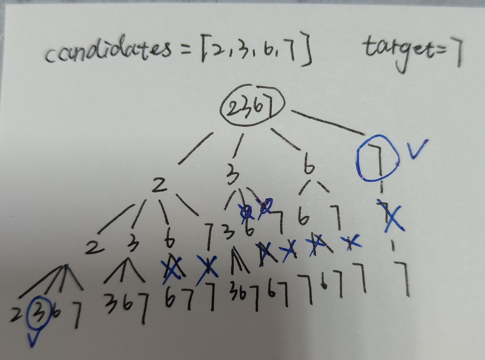

# Back Trace

Back Trace algorithm is a kind of Deep First Search(DFS) on a Tree(no need to be a binary tree).

## In total

1. For an example input(do not be too simple), draw a tree for DFS.
2. When to stop recurse? -> record the depth of the tree.
3. How to prune? -> return in some specific condition.

### Template

```python
def backtracing(params):
    if end_condition:
        processing
    for i in sons_of_the_father_node:
        processing
        backtracing(modified_params)
        processing
```

### Tips

- $O(n^2)$, $O(nlogn)$ is much smaller than the traceback complexity($O(2^n*n)$). So feel free to sort the list if necessary.

## Problems

Trace back problems can include:

- calculate all the combinations -> the combianation index as layer depth. layer1: the first num in the combination.
- split the string in a specific manner, return all the partition schemes -> the split time as layer depth. layer1: the first split. s[0:i], each i represents a node in the first layer.
- problems that need traverse all and return all the solutions.

> [216. Combination Sum 3](https://leetcode.com/problems/combination-sum-iii/description/)

from [1,9] choose k non-redundant elements and sums up to n.

- construct a normal tree, search for every position in k.
  - **from top to bottom**, need to record a **dynamic path list**(or pass the path list in every dfs function).
    - dynamic path list: create a global path=[], pop the current num after processing.
  - from bottom to top, need to traverse the leaf node -> can not prune.
- construct a binary tree, search for every element(choose or not) in n.

**Pruning** conditions can be found during the drawing of tree.

> [39. Combination Sum](https://leetcode.com/problems/combination-sum/description/)

The differences from problem 216:

1. The length of the path list(depth of the tree) is not fixed.

   - Just traverse endlessly, it will return when the sum exceeds the target.

2. Need to **remove the redundant path list**, eg: [1,1,2],[1,2,1],[2,1,1] are the same.

   - When traversing to the second son, the non-redundant combinations should not include the value of the first son. Since the first son has traversed all the possible combinations that include its value. Like the figure below.

     

   - We can either **use a set** to record whether the current element is occurred before, or **sort the nums list first** then jump over the same elements when visited once.

**Tips:** for the combination problems, remove redundance -> ==traverse in sequence==.

> [47. Permutations 2](https://leetcode.com/problems/permutations-ii/description/)

- Find the possible nodes -> set `choices` to record the possible indexes. Change it together with the list `path`.
  - Remember to copy the original set to traverse, because you can't change the set while traversing it in the same time.
- Remove the duplicates in sons -> sort or create a set to record each time.

> [51. N-Queens](https://leetcode.com/problems/n-queens/)

Typical problem, draw the backtrace tree and pruning. Each tree layer represents one row in the chessboard. -> $O(n!), O(n)$

- **Column**: record the columns that are already put in Queens.
- **Diagonal 1**: record the diagonals(from left top to right bottom) that are already put in Queens. The **difference between row and column** indexes of one grid is fixed in the same diagonal.
- **Diagonal 2**: record the diagonals(from left bottom to right top) that are already put in Queens. The **sum of row and column** indexes of one grid is fixed in the same diagonal.

We can use set or bit operation to record the three conditions.

> [37. Sudoku Solver](https://leetcode.com/problems/sudoku-solver/description/)

Difficulties:

- How to traverse: **create a spaces list** to record the spaces that need to fill in. Cause every space is a equivalent node, the backtrace tree is a single branch tree in this problem.
- How to turn (row,column) into block id: create **a three-dimensional array blocks**, with `blocks[row//3][column//3]` representing the corresponding block of space (i,j).

