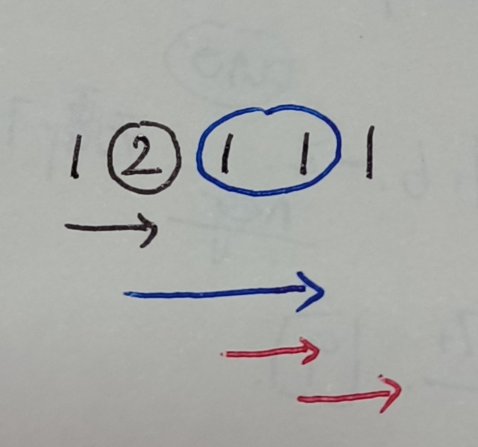
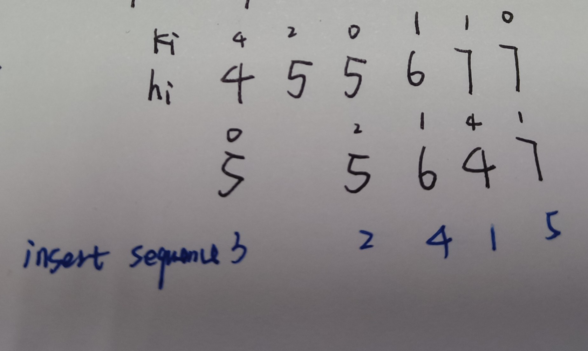

# Greedy Algorithm

An algorithm that tries to derive the global optimum from local optimums. If you can't find a counter-example for the derivation, the greedy algorithm can come in handy. 

A simpler choice than dp. 

It usually has $O(n)$ time complexity and $O(1)$ space complexity.

## In total

### Tips

- Like problem 45, update the **end condition for one step** during iteration.
- The **changes of the summary** can also be used to judge.
- **Traversing twice** is a easy way to process sequences with ascending and descending.

## Problems

### List

> [53. Maxisum Subarray](https://leetcode.com/problems/maximum-subarray/description/)

- Update the maxisum during iteration.
- Clear the current sum once it becomes negative.

> [45. Jump Game 2](https://leetcode.com/problems/jump-game-ii/)

A jump step: start point -> end point.

Update the step only after **all the possible end points**(eg: the blue circle) can't reach the end of the list.

> [134. Gas Station](https://leetcode.com/problems/gas-station/)

Solution with one traversal:

- record the sum of difference between `gas[i]` and `cost[i]`(prefix). If the sum becomes smaller, that means the following total cost is greater than gas, update the start point and the min number of sum.

> [135. Candy](https://leetcode.com/problems/candy/description/)

- **general solution**: For problems that have peaks and valleys, we can **traverse twice**(from left to right and from right to left) to process the ascending sequences. -> $O(2n)$

- In this problem, $O(n)$ is also possible if analyze comprehensively.

> [406. Queue Reconstruction by Height](https://leetcode.com/problems/queue-reconstruction-by-height/)

We can **sort the person by height**, and insert each person according to the $k_i$. Specifically, as person i can ignore the people shorter than him, he can inserted into the position that has $k_i$ vacancies for the higher people. For people **have the same height**, the one with greater $k_i$ should reserve specific vacancies for the ones with smaller $k_i$, which means he is theoretically shorter than others with the same height.

> [435. Non-overlapping Intervals](https://leetcode.com/problems/non-overlapping-intervals/)

**Method**: choose the interval that ends small, so that more intervals later can be chosen. -> sort by $end_i$.

### Tree

> [968. Binary Tree Cameras](https://leetcode.com/problems/binary-tree-cameras/description/)

DP problem. Can be optimized with greedy algorithm.

**Greedy strategy**: 

Start from the bottom. Make sure all leaves don't have camera. -> PostOrder

(If starting from the top, we can only make sure the root(only one node) doesn't have camera.)

**Status**:

The status **are calculated during the PostOrderTraversal**.

- 0: nodes that are not covered by camera.
- 1: nodes that are covered, but don't have camera.
  - That means some or one of their sons would have camera. Not father because we haven't reach to the father yet.
- 2: nodes that have camera.

**Conditions:**

- Null node -> status 1
- Leaves -> status 0
- Nodes that have status 0 as son -> status 2
- Nodes that have status 2 as son -> status 1
- Nodes of other conditions -> status 0