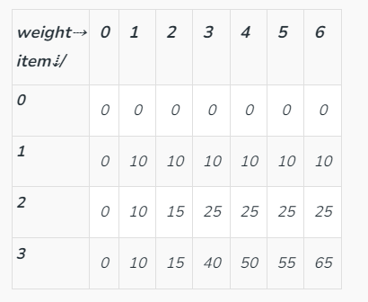

# Dynamic Programming

An algorithm that simplifies a complicated problem by **breaking it down into simpler sub-problems** in a recursive manner. Also, we need to **record the results of the sub-problems** to reduce the repeated calculation.

- DP can avoid the repeated calculation of one situation in recurse. 

- Trace back + record the computation results (memorized search) -> DP

## In total

1. Create a dp[] to record the recursive results. -> Figure out the dp[i]'s meaning.
2. Conclude the state transition function. -> by enumeration to find out the rule.
3. Initialize the dp[].
4. Fill in the dp[].
5. Return dp[n].

### Tips

- 

## Problems

### Classical DP

#### one dimensional `dp[]`

> [70. Climbing Stairs](https://leetcode.com/problems/climbing-stairs/description/) / Also Fibonacci.

- **dp[i]**: the number of ways to achieve the i-th stair.
- **state transition**: dp[i] = dp[i-1] + dp[i-2]. Only need to record the previous two num.
- **initialize**: dp[0] -> meaningless; dp[1] -> 1; dp[2] -> 2

#### two dimensional `dp[][]`

> [63. Unique Paths 2](https://leetcode.com/problems/unique-paths-ii/description/)

Two dimensional `dp[][]` to record the paths to each grid. Space complexity: $O(mn)$

-> Space $O(n)$ optimization: **scrolling array**.

Just record one row dp[n]. For the current `grid[i][j]`, dp[j] is the path num of the `grid[i-1][j]`, dp[j-1] if the path num of the `grid[i][j-1]`. So **dp[j] += dp[j-1]** can update the dp.

- **dp[j]**: the number of paths of the j-th grid of the current row.
- **state transition**: dp[j] += dp[j-1]
- **initialize**: dp[0] = 1 if not obstacle else 0

#### state transition

> [343. Integer Break](https://leetcode.com/problems/integer-break/description/)

- **dp[i]**: the maximum product of integer i.
- **state transition**: $dp[i] = max(dp[i],j*dp[i-j],j*(i-j))$ for j in range(1,i).
  - for integer i > 4, dp[i] > i
  - for integer i <= 3, dp[i] < i. as dp[2]=1; dp[3]=2.
  - the item dp[i] in the max() is to update the dp during the iteration of j.
- **initialize**: `dp = [0]*(n+1)`

### Knapsack Problem

An example of combinational optimization problem.

Given a bag with maximum weight capacity of $W$ and a set of items, each having a **weight** and a **value**. Decide the number of each item to put into the bag such that the total weight is less than $W$ and the total value is ==maximized==.

#### 0/1 knapsack

We are given $N$ items where each has weight($w_i$) and value($v_i$). We can either put an item completely into the bag(1) or cannot put it at all(0).

##### DP Solution

Re-computation of the same subproblems can be avoided by constructing an array `dp[][]`. Rows represent the items. Columns represent the remaining capacity of the bag.

Eg: Let Weights = [1, 2, 3], Values = [10, 15, 40], Capacity = 6



- `dp[i][j]` means the maximum value of item 0-i with the capacity j. -> a sub-problem of the `dp[N-1][W-1]`.
- state transition: $dp[i][j] = max(dp[i - 1][j], dp[i - 1][j - weight[i]] + value[i])$

State optimization by **scrolling array**.

- Traverse the columns **from right to left**. -> The left part can't be updated first as their value are needed in the later updating.

- ```python
  dp = [0] * (W+1) # initiate with 0
  for i in range(n): # items
      for j in range(W, w[i]-1, -1): # capacities, from right to left
          dp[j] = max(dp[j], dp[j-w[i]] + v[i])
  # code tips
  # 1. Note that capacity 0 is needed. So the length of the dp is W+1.
  # 2. The indexes that need to be updated are from w[i] to W. The indexes before w[i] do not need to change.
  ```

#### Problems of 0/1 knapsack

- The upper bound of the knapsack is `capacity`, get **the number of combinations** or **the maximum value**.
- The knapsack is just full, get **the number of combinations** of **the maximum/minimum value**.
- The lower bound of the knapsack is `capacity`, get **the number of combinations** or **the minimum value**.

> [416. Partition Equal Subset Sum](https://leetcode.com/problems/partition-equal-subset-sum/)

The problem can be seen as select some nums whose summary equals to $sum(nums) / 2$. This is a 0/1 knapsack problem, with the **different nums being different items** and **the numbers being the weights**. The capacity is $sum(nums) / 2$, noted as target.

- **`dp[i][j]`**: Bool value. Represent whether the summary of subset of items 0-i can equal to j. (The items selected are just to fit in.)

- **state transition**:
  $$
  dp[i][j] = \left\{
  \begin{array}{rcl}
   dp[i-1][j] \ |\  dp[i-1][j-nums[i]], j >= nums[i] \\
   dp[i-1][j], j < nums[i]
  \end{array}
  \right.
  $$

- **initialize**: `dp = [True] + [False] * target`

> [1049. Last Stone Weight 2](https://leetcode.com/problems/last-stone-weight-ii/description/)

The problem can be translated into traditional 0/1 knapsack, with a capacity of sum/2. Each item's weight is equal to its value, both are `stones[i]`.

How to translate?

1. From the description, we can **split the stones into two heaps**. The remained one stone can be calculated as: $ans = sum(heap1) - sum(heap2)$, and we need to find the minimum ans. As ans >= 0, we have $sum(heap1) >= sum(heap2)$.
2. Also, $sum(heap1) + sum(heap2) = sum(stones)$. So, ans can be represented only with heap2: $ans = sum(stones) - 2*sum(heap2)$. **The minimum ans can be translated into the maximum sum(heap2)**. -> not heap1 because we want to find the maximum(consistent with 0/1 knapsack problem) not minimum.
3. We also have $sum(heap2) <= sum(stones) // 2$. So the capacity is $sum(stones) // 2$.

> [494. Target Sum](https://leetcode.com/problems/target-sum/description/)

The essence of this problem is to calculate the **combination number** $C^{k}_{len(nums)}$.

1. Same to 1049, we split the nums into positive heap and negative heap. We have $sum(heap1)+sum(heap2)=sum(nums)$ and $sum(heap1)-sum(heap2)=target$. So $sum(heap2)=(sum(nums)-target)/2$. That is our capacity.
   - Validate the capacity >= 0 and to be integer.
2. Our goal is to find the combinations that sum **equal to** the capacity, and record the number of combinations.
   - **State transition**: $dp[j] += dp[j-w[i]]$
   - **initialize**: $dp[0] = 1$. -> $sum(nums)==target$, so heap2 is empty.

#### Unbounded Knapsack

We are given $N$ items where each has weight($w_i$) and value($v_i$). We can either put an item completely into the bag(1) or cannot put it at all(0). This is different from 0/1 Knapsack problem, here we are allowed to use an **unlimited number of instances of an item**.

##### DP Solution

State optimization by **scrolling array**:

- Different from 0/1 Knapsack, we need to traverse the columns **from left to right**.

  ```python
  dp = [0] * (W+1)
  for i in range(n):
      for j in range(w[i], W+1): # different from 0/1
          dp[j] = max(dp[j], dp[j-w[i]] + v[i])
  ```

  