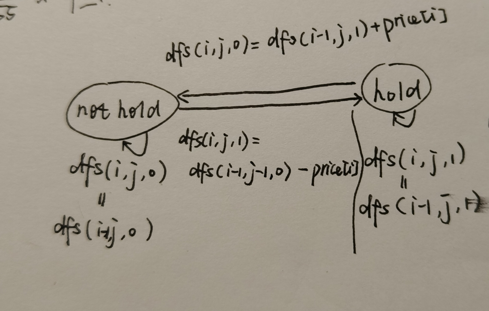
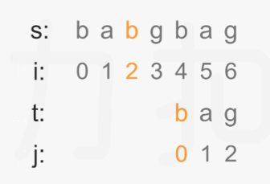
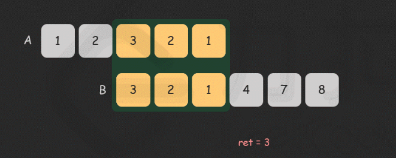

# Dynamic Programming

An algorithm that simplifies a complicated problem by **breaking it down into simpler sub-problems** in a recursive manner. Also, we need to **record the results of the sub-problems** to reduce the repeated calculation.

- DP can avoid the repeated calculation of one situation in recurse. 
- Trace back + record the computation results (memorized search) -> DP

For DP, we have two methods: memorized(@cache) traceback(from bottom to top) and memorized iteration(from top to bottom.)

In python, the decorator `@cache` can store the calculated results of the function in cache. That can help us realize the memorized traceback, by adding `@cache` in front of the dfs function.

## In total

1. Create a dp[] to record the recursive results.
2. Define the state. -> Figure out the dp[i]'s meaning.
3. Conclude the state transition function. -> by enumeration to find out the rule.
4. Initialize the dp[].
5. Fill in the dp[], return dp[n].

### Tips

- 

## Problems

### 1. Classical DP

#### one dimensional `dp[]`

> [70. Climbing Stairs](https://leetcode.com/problems/climbing-stairs/description/) / Also Fibonacci.

- **dp[i]**: the number of ways to achieve the i-th stair.
- **state transition**: dp[i] = dp[i-1] + dp[i-2]. Only need to record the previous two num.
- **initialize**: dp[0] -> meaningless; dp[1] -> 1; dp[2] -> 2

> [560. Subarray Sum Equals K](https://leetcode.com/problems/subarray-sum-equals-k/)

Calculating prefix sum dp[i].

Notice that for current i, and j < i, if dp[i]-dp[j] == k, ans += 1. -> if `dp[j] == dp[i] - k`, ans += 1. Therefor, we need to find whether and how many dp[i]-k are in the previous prefixsum.

We use a hashmap{prefixsu: count} to record this.

#### two dimensional `dp[][]`

> [63. Unique Paths 2](https://leetcode.com/problems/unique-paths-ii/description/)

Two dimensional `dp[][]` to record the paths to each grid. Space complexity: $O(mn)$

-> Space $O(n)$ optimization: **scrolling array**.

Just record one row dp[n]. For the current `grid[i][j]`, dp[j] is the path num of the `grid[i-1][j]`, dp[j-1] if the path num of the `grid[i][j-1]`. So **dp[j] += dp[j-1]** can update the dp.

- **dp[j]**: the number of paths of the j-th grid of the current row.
- **state transition**: dp[j] += dp[j-1]
- **initialize**: dp[0] = 1 if not obstacle else 0

#### special state transition

> [343. Integer Break](https://leetcode.com/problems/integer-break/description/)

- **dp[i]**: the maximum product of integer i.
- **state transition**: $dp[i] = max(dp[i],j*dp[i-j],j*(i-j))$ for j in range(1,i).
  - for integer i > 4, dp[i] > i
  - for integer i <= 3, dp[i] < i. as dp[2]=1; dp[3]=2.
  - the item dp[i] in the max() is to update the dp during the iteration of j.
- **initialize**: `dp = [0]*(n+1)`

### 2. House Robber

The house robber series has three problems.

> [198. House Robber](https://leetcode.com/problems/house-robber/description/)

This is classical dp[] problem with state transition of $dp[i]=max(dp[i-1],dp[i-2]+houses[i])$.

> [213. House Robber 2](https://leetcode.com/problems/house-robber-ii/description/)

Compared to 198, this problem has an additional condition: the first and the last houses are adjacent.

According to the 198's method, we consider a situation that the fist house has a great amount of money. So dp[i-1] and dp[i-2] will both contain money of the first house. In this way, we can not pick the last house. But what if the last house also has a lot of money? Maybe not picking the first house is better?

-> We **solve this problem by addressing two problem 198**: $max(houses[0:n-1], houses[1:n])$.

> [337. House Robber 3](https://leetcode.com/problems/house-robber-iii/description/)

The houses are arranged in a binary tree. It's quite like the problem 968 in Greedy_Algorithm. But 337 doesn't have a greedy method to decide whether the leaves are selected.

Still, we need to record the dp[i-1] and dp[i-2]. During PostOrderTraversal, we loss the return value of the son's son. So we need to get it from son. 

1. Each node return a tuple (s, n), with a being the maximum value with node selected, b being the maximum value with node not selected. 

2. When get the return tuples from the left son and right son, we represents them with $l_s, l_n, r_s, r_n$. The current results are represented as $s, n$.

3. $s=max(node.val+l_n+r_n)$

   $n=max(l_s,l_n)+max(r_s,r_n)$

### 3. Knapsack Problem

An example of combinational optimization problem.

Given a bag with maximum weight capacity of $W$ and a set of items, each having a **weight** and a **value**. Decide the number of each item to put into the bag such that the total weight is less than $W$ and the total value is ==maximized==.

#### 3.1 0/1 knapsack

We are given $N$ items where each has weight($w_i$) and value($v_i$). We can either put an item completely into the bag(1) or cannot put it at all(0).

##### DP Solution

Re-computation of the same subproblems can be avoided by constructing an array `dp[][]`. Rows represent the items. Columns represent the remaining capacity of the bag.

Eg: Let Weights = [1, 2, 3], Values = [10, 15, 40], Capacity = 6


- `dp[i][j]` means the maximum value of item 0-i with the capacity j. -> a sub-problem of the `dp[N-1][W-1]`.
- state transition: $dp[i][j] = max(dp[i - 1][j], dp[i - 1][j - weight[i]] + value[i])$

State optimization by **scrolling array**.

- Traverse the columns **from right to left**. -> The left part can't be updated first as their value are needed in the later updating.

- ```python
  dp = [0] * (W+1) # initiate with 0. If need to calculate the combinations number, dp[0]=1
  for i in range(n): # items
      for j in range(W, w[i]-1, -1): # capacities, from right to left
          dp[j] = max(dp[j], dp[j-w[i]] + v[i])
  # code tips
  # 1. Note that capacity 0 is needed. So the length of the dp is W+1.
  # 2. The indexes that need to be updated are from w[i] to W. The indexes before w[i] do not need to change.
  ```

##### Problems of 0/1 knapsack

- The upper bound of the knapsack is `capacity`, get **the number of combinations** or **the maximum value**.
- The knapsack is just full, get **the number of combinations** of **the maximum/minimum value**.
- The lower bound of the knapsack is `capacity`, get **the number of combinations** or **the minimum value**.

> [416. Partition Equal Subset Sum](https://leetcode.com/problems/partition-equal-subset-sum/)

The problem can be seen as select some nums whose summary equals to $sum(nums) / 2$. This is a 0/1 knapsack problem, with the **different nums being different items** and **the numbers being the weights**. The capacity is $sum(nums) / 2$, noted as target.

- **`dp[i][j]`**: Bool value. Represent whether the summary of subset of items 0-i can equal to j. (The items selected are just to fit in.)

- **state transition**:
  $$
  dp[i][j] = \left\{
  \begin{array}{rcl}
   dp[i-1][j] \ |\  dp[i-1][j-nums[i]], j >= nums[i] \\
   dp[i-1][j], j < nums[i]
  \end{array}
  \right.
  $$

- **initialize**: `dp = [True] + [False] * target`

> [1049. Last Stone Weight 2](https://leetcode.com/problems/last-stone-weight-ii/description/)

The problem can be translated into traditional 0/1 knapsack, with a capacity of sum/2. Each item's weight is equal to its value, both are `stones[i]`.

How to translate?

1. From the description, we can **split the stones into two heaps**. The remained one stone can be calculated as: $ans = sum(heap1) - sum(heap2)$, and we need to find the minimum ans. As ans >= 0, we have $sum(heap1) >= sum(heap2)$.
2. Also, $sum(heap1) + sum(heap2) = sum(stones)$. So, ans can be represented only with heap2: $ans = sum(stones) - 2*sum(heap2)$. **The minimum ans can be translated into the maximum sum(heap2)**. -> not heap1 because we want to find the maximum(consistent with 0/1 knapsack problem) not minimum.
3. We also have $sum(heap2) <= sum(stones) // 2$. So the capacity is $sum(stones) // 2$.

> [494. Target Sum](https://leetcode.com/problems/target-sum/description/)

1. Same to 1049, we split the nums into positive heap and negative heap. We have $sum(heap1)+sum(heap2)=sum(nums)$ and $sum(heap1)-sum(heap2)=target$. So $sum(heap2)=(sum(nums)-target)/2$. That is our capacity.
   - Validate the capacity >= 0 and to be integer.
2. Our goal is to find the combinations that sum **equal to** the capacity, and record **the number of combinations**.
   - **State transition**: $dp[j] += dp[j-w[i]]$
   - **initialize**: $dp[0] = 1$. -> $sum(nums)==target$, so heap2 is empty.

#### 3.2 Unbounded Knapsack

We are given $N$ items where each has weight($w_i$) and value($v_i$). We can either put an item completely into the bag(1) or cannot put it at all(0). This is different from 0/1 Knapsack problem, here we are allowed to use an **unlimited number of instances of an item**.

##### DP Solution

State optimization by **scrolling array**:

- Different from 0/1 Knapsack, we need to traverse the columns **from left to right**.

  ```python
  dp = [0] * (W+1)
  for i in range(n):
      for j in range(w[i], W+1): # different from 0/1
          dp[j] = max(dp[j], dp[j-w[i]] + v[i])
  ```


##### problems of unbounded knapsack

> [377. Combination Sum 4](https://leetcode.com/problems/combination-sum-iv/) *

This problem is to calculate the **permutation** of the combinations. For this kind of problem, we need to **first traverse the capacities, then the items**. Other situations like: the number of combinations, maximum, minimum, we can follow the traditional first item then capacity sequence.


Still, We draw the dp table as follow.


For the **combination** method, we update the dp[] by rows. We think about what is the next state when adding a new item.  When we put the new item to bag, the combination num is dp[i-w[item_idx]]. When we don't put it, the combination num is dp[i]. So state transition can be: dp[i] += dp[i-w[item_idx]].

- This method doesn't consider the sequence of the combination as the item later can't be put before. For example, to fill in the capacity 3, when we traverse the first row, we get the combination 1,1,1. When second row, the combinations are 1,1,1(don't put 2); 1,2(put 2). When third row, 1,1,1; 1,2; 3. The 2,1 will never be calculated as the item 2 is traversed after 1.

For the permutation method, we update the dp[] by columns. For each capacity, we traverse the items to calculate what the state becomes when adding the current item and not adding the current item. And the result is accumulated by column.

- This is more like a trace back method so the permutation won't be missed.

- ```python
  dp = [1] + [0] * capacity      # still initialize dp[0]=1.
  for i in range(1, capacity+1): # dp[0] is not need to be updated.
      for num in nums:
          if num <= i:           # for num > i, it is too heavy to put in the bag.
              dp[i] += dp[i-num]
  ```


> [139. Word Break](https://leetcode.com/problems/word-break/description/)

Ask yourself some questions.

Is this problem knapsack? 0/1 or unbounded?

- yes. The string `'applepenapple'` can be the capacity and the word dict `['apple', 'pen']` can be the items.
- unbounded. As the items can be used repeatedly.

Is the combinations sequence-dependent(permutation) or sequence-independent(combination)?

- permutation. As the 'applepenapple' can only be composed in the 1.apple 2.pen 3.apple order.

So we first traverse capacity. What does the `dp[i][j]` mean?

- Whether the substring s[0:i] can be composed of word dict[0:j].

What is the state transition function?

- $dp[i]=True, only\ when\ dp[i-len(item)]==True\ and\ dp[i-len(item):i]\ in\ dict.$

For the iteration of item, we can convert it to the iteration of the sub_indexes. And query it in the dict. For example, for sub string 'applepen', we query whether 'a' is True and 'pplepen' in the dict; whether 'ap' is true and 'plepen' in the dict, and so on.

### 4. FSM DP

FSM, Finite-State Machine. When a **sub-problem(dp[i]) contains multiple states**, we can **draw the FSM** to define the state transition function.

> [188. Best Time to Buy and Sell Stock 4](https://leetcode.com/problems/best-time-to-buy-and-sell-stock-iv/description/)

In this problem, we need to buy and sell stocks ==within k times== to get the maximum profits. We can only hold one stock at a time.

We need to figure out the relations between dp[i-1] and dp[i]. dp[i] contains two independent states: **hold a stock or not, the current transactions bound k**.

So we define a state `dfs(i,j,hold)`, which means the maximum profit in `day: i`, with the `transactions bound: j` and `whether the stock is at hand: hold`. We draw the following FSM to clarify the four state transitions. Note that we only need j-1 once in a buy and sell transaction.



Next, we define the boundary of dfs (initialization in iterative dp).

- $dfs(\cdot,-1,\cdot)=-\infty$, j can at least be 0.
- $dfs(-1,j,0)=0$, the 0-th day has 0 profit and doesn't hold any stock.
- $dfs(-1,j,1)=-\infty$, the 0-th day can't hold any stock.

Legal range of i: `0~n-1`; j: `0~k`; hold: `True, False`.

```python
# Code for memorized dfs
def maxProfit(k: int, prices: List[int]) -> int:
    n = len(prices)
    @cache
    def dfs(i, j, hold):
        if j < 0:
            return -inf
        if i < 0:
            return -inf if hold else 0
        if hold:
            return max(dfs(i-1,j,True), dfs(i-1,j,False)-prices[i])
        return max(dfs(i-1,j,False), dfs(i-1,j-1,True)+prices[i])
    # dfs(n-1, k, True) <= dfs(n-1, k, False)
    return dfs(n-1, k, False)
```

For initialization of iterative dp:

- $dp[\cdot][0][\cdot]=-\infty$
- $dp[0][j][0]=0, j >= 1$
- $dp[0][j][1]=-\infty, j>=1$

Legal range of i: `0~n`; j: `0~k+1`; hold: `True, False`. As i=0 and j=0 be the boundary.

```python
# iterative dp
n = len(prices)
dp = [[[-inf]*2 for _ in range(k+2)] for _ in range(n+1) ]
for j in range(1, k+2):
    dp[0][j][0] = 0
for i in range(1, n+1):
    for j in range(1, k+2):
        dp[i][j][0] = max(dp[i-1][j][0], dp[i-1][j-1][1]+prices[i-1])
        dp[i][j][1] = max(dp[i-1][j][1], dp[i-1][j][0]-prices[i-1])
return dp[n][k+1][0]
# space optimization, O(k*n)
dp = [[-inf]*2 for _ in range(k+2)]
for j in range(1,k+2):
    dp[j][0] = 0
# O(n) space is optimzied, but time not.
for i in range(1, n+1):
    # dp[j] relies on dp[j-1], so smaller j can't be optimized first.
    for j in range(k+1, 0, -1): 
        # dp[j][1] relies on dp[j][0], so update 1 first.
        dp[j][1] = max(dp[j][1], dp[j][0]-prices[i-1])
        dp[j][0] = max(dp[j][0], dp[j-1][1]+prices[i-1])
return dp[k+1][0]
```

For buy and sell stocks ==exactly k times==, we just need to modify the initialization.

- $dp[0][j][0]=0, j >= 1$ to $dp[0][1][0]=0, dp[0][j][0]=-\infty, j > 1$
- When j=1, we buy and sell stocks exactly 0 times.

For buy and sell stocks ==at least k times==, we just need to modify the initialization.

- $dp[0][j][0]=0, j >= 1$ to $dp[0][0][0]=0, dp[0][j][0]=-\infty, j >= 1$

For buy and sell stocks ==with infinite times==, we just remove the state j and draw the new FSM.

- $dfs(i,0)=max(dfs(i-1,0), dfs(i-1,1)+prices[i])$
- $dfs(i,1)=max(dfs(i-1,1), dfs(i-1,0)-prices[i])$

For buy and sell stocks ==with cooldown==, we delay the buying time as follow.(eg, 1 day's cooldown)

- $dfs(i,0)=max(dfs(i-1,0), dfs(i-1,1)+prices[i])$
- $dfs(i,1)=max(dfs(i-1,1), dfs(i-2,0)-prices[i])$

```python
# the pre day not hold, current day not hold, current day hold
dp = [0, 0, -inf]
for p in prices:
    # in this way we don't have to consider the update sequence.
    dp[0], dp[1], dp[2] = dp[1], max(dp[1], dp[2]+p), max(dp[2], dp[0]-p)
return dp[1]
```

### 5. Linear DP

#### LCS VS LIS

- LCS, no additional constraint except for common subsequence.
  - Answer is `dp[m][n]` and not choosing the last number is acceptable.
- LIS, has additional constraint like increasing. So we can choose the appropriate numbers to update dp.
  - Answer is max(dp) and the last number must be choosed.

#### 5.1 Longest Common Subsequence, LCS

> [1143. Longest Common Subsequence](https://leetcode.com/problems/longest-common-subsequence/description/)

For an array/string 'abcde', 'abc' is a **subarray/substring**, 'ae' is a **subsequence**.

We consider the two string s,t have the lengths m,n. The LCS length of s and t would be `dp[m][n]`.

- $dp[i][j]$: the LCS length of the substrings s[:i+1], t[:j+1].
- $\left\{\begin{aligned}dp[i+1][j+1]&=dp[i][j]+1, if\ s[i]==t[j]\\dp[i+1][j+1]&=max(dp[i][j+1], dp[i+1][j]), if\ s[i]\neq t[j]\end{aligned}\right.$
  - If s[i]==t[j], $dp[i][j+1]/dp[i+1][j] <= dp[i][j]+1$
  - If s[i]!=t[j], $dp[i][j] <= dp[i+1][j]/dp[i][j+1]$
- Initialize: $dp[0][\cdot]=0, dp[\cdot][0]=0$. Indexes = 0 means the substring is ''.

```python
# space O(mn)
m, n = len(text1), len(text2)
dp = [[0]*(n+1) for _ in range(m+1)]
for i, x in enumerate(text1):
    for j, y in enumerate(text2):
        dp[i+1][j+1] = dp[i][j] + 1 if x == y else max(dp[i][j+1], dp[i+1][j])
return dp[m][n]
# space O(n)
m, n = len(text1), len(text2)
dp = [0] * (n+1)
for i, x in enumerate(text1):
    pre = dp[0] # initialize pre to memorize the left-top number.
    for j, y in enumerate(text2):
        tmp = dp[j+1]
        dp[j+1] = pre + 1 if x == y else max(dp[j+1], dp[j])
        pre = tmp
return dp[n]
```

> [72.Edit Distance](https://leetcode.com/problems/edit-distance/description/)

- $dp[i][j]$: the minimum operation num to translate the substring s[:i+1] to t[:j+1].
- $\left\{\begin{aligned}dp[i+1][j+1]&=dp[i][j], if\ s[i]==t[j]\\dp[i+1][j+1]&=min(dp[i+1][j], dp[i][j+1], dp[i][j])+1, if\ s[i]\neq t[j]\end{aligned}\right.$
  - If s[i]==t[j], the operation num doesn't change.
  - If s[i]!=t[j], the operation num is the mininum from insert, delete and replace. Insert means when insert t[j], we can translate the substring s[:i+1] to t[:j+1].
- Initialize: 
  - $dp[0][j] = [j]$, when source string is '', the minimum operation num to the target string would be the length of the target string.
  - $dp[i][0]=i$, when target string is '', the minimum operation num to the target string would be the length of source string.

> [115. Distinct Subsequences](https://leetcode.com/problems/distinct-subsequences/)

- $dp[i][j]$: The number of t[:j+1] existing in s[:i+1].

- $\left\{\begin{aligned}dp[i+1][j+1]&=dp[i][j]+dp[i][j+1], if\ s[i]==t[j]\\dp[i+1][j+1]&=dp[i][j+1], if\ s[i]\neq t[j]\end{aligned}\right.$

  - when s[i]==t[j], the number of matching subsequences could be: :one: We match the orange 'b', the number that 'ag' exists in 'gbag'. :two: We don't match the orange 'b', the number that 'bag' in 'gbag'.

    

- Initialize: $dp[\cdot][0]=1$, when t[:j+1]=='', it exists in any s[:j+1].

#### 5.2 Longest Increasing Subsequence, LIS

> [300. Longest Increasing Subsequence](https://leetcode.com/problems/longest-increasing-subsequence/description/)

**DP, time complexity** $O(n^2)$.

- dp[i]: The length of LIS **which has nums[i] as the last number**.
  - The answer would be **max(dp)**
- $dp[i] = max(dp[j])+1, j<i\ and\ nums[j]<nums[i]$
- Initialize: dp[i]=0, i ranges in 0~n-1.

**Greedy + bisect, time complexity** $O(nlogn)$

- We maintain a list st, **keep it in order and modify it in the middle**.(not like monotonic stack)

  ```python
  n = len(nums)
  st = []
  for num in nums:
      # bisect_right if it is not strictly increasing subsequence.
      i = bisect_left(st, num) # find the index that can be inserted in
      if i == len(st):
          st.append(num)
      else:
          st[i] = num
  return len(st)
  ```

> [718. Maximum Length of Repeated Subarray](https://leetcode.com/problems/maximum-length-of-repeated-subarray/)

**DP, $O(mn)$**

- $dp[i+1][j+1]$: the length of the common subarray ending in nums1[i]/nums2[j]

  - The answer would be max($dp[i][j]$)

- $dp[i+1][j+1]=0, if\ nums1[i] \neq nums2[j]$

  $dp[i+1][j+1]=dp[i][j]+1, if\ num1[i]==num2[j]$

- Initialize: $dp[0][\cdot]=dp[\cdot][0]=0$

**Sliding Window, $O((m+n)*min(m,n))$**

We can use two pointers to match the two array. During each traverse, we calculate the maximum matching length. In total, we slide A from the head to the end of B and slide B from the head to the end of A.



#### 5.3 Palindromic Substring

> [647. Palindromic Substrings](https://leetcode.com/problems/palindromic-substrings/)

We can construct sub-problems from the sides to the middle.

- $dp[i][j]$: Whether s[i:j+1] is palindromic string.
- $dp[i][j] = dp[i+1][j-1]\ and\ s[i]==s[j]$
  - $dp[i][j]$ depends on $dp[i+1][j-1]$, so iterate i from n-1 to 0, iterate j from i to n-1.

