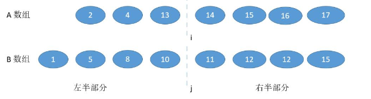
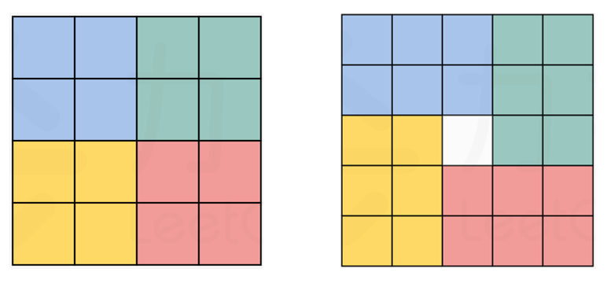
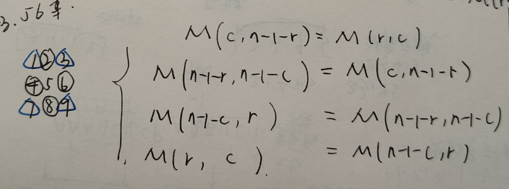
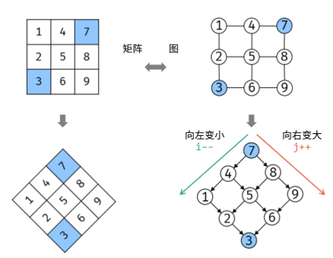

# 数组

数组（列表）是一种数据结构，查找时间复杂度O(1)，插入时O(n)。

## 基本语法

### 创建/删除 list

```python
l = []
l = list()

del l
```

### list操作

```python
## 切片
l[begin:end:step]   # step可以<0，此时begin>end

# 原地操作，返回None
l.append()
l.extend()   # 输入sequence，"A" 可以，3 不行
l.reverse()  # l[::-1], return None

l.pop() # 删除最后一个元素并返回该元素

### bisect
# 对于已排序的数组l，可以用py3内置的二分查找函数
i = bisect_left(l,x) # 找的是第一个>=x的元素下标
j = bisect_right(l,x) # 找的是第一个>x的元素下标
# eg1, l=[1,5,9], x=7 -> i=j=2
# eg1.1, l=[1,5,9], x=10 -> i=j=3
## 当x不在l中时，返回合适的插入位置
# eg2, l=[1,5,9], x=9 -> i=2, j=3
# eg3, l=[1,5,5,9], x=5 -> i=1,j=3
bisect_left(l,x,begin,end,key = lambda x: x[1]) # [begin, end)
```

## 题目

### 1. 二分查找

> [704. Binary Search](https://leetcode.cn/problems/binary-search/description/) —— 排序且无重复数组

#### 细节注意:

- **初始化的边界**需要覆盖所有元素：l=0，r=n-1

- 计算mid需要考虑**整数溢出**：

  ```python
  mid = (l+r)//2  # 非常容易溢出
  mid = l + (r-l)//2  # 好一点，但仍然有可能
  mid = (l+r) >> 1  # 最好
  ```

- 根据不同的条件选择**left mid**和**right mid**

  ```python
  mid = (l+r) >> 1  # left mid
  mid = (l+r+1) >> 1  # right mid
  ```

  如何选择取决于if else的条件是怎么写的。想象只剩下两个元素待查找了，程序运行到了else块中，错误的mid会无限循环因为l或r都不移动。我们需要保证每次移动都会缩短r-l。

  ==left mid用l来移动==

  ```python
  mid = (l+r) >> 1
  
  if target > nums[mid]:
      l = mid + 1  # target可能的范围在l+1~n-1
  else:
      r = mid  # mid可能是答案
  ```

  退出while循环：`l==r` 且返回值>=目标值的元素下标（插入的正确位置） -> 除了在最右边的目标值

  0 1 2 3 4 5, 目标值: 2.5, `l==r==3`; 目标值: 6, `l==r==5`

  ==right mid用r来移动==

  ```python
  mid = (l+r+1) >> 1
  
  if target < nums[mid]:
      r = mid - 1
  else:
      l = mid
  ```

  退出while循环：`l==r` 且返回值<=目标值的元素下标（插入的正确位置） -> 除了在最左边的目标值

  0 1 2 3 4 5, target: 2.5, `l==r==2`; target: -1, `l==r==0`

- **While loop**

  ```python
  while(l<r): # 注意没有=，=是退出条件
      ...
  return -1 if l > r or nums[l] != target else l
  # 若数组一开始为空，则l=0，r=-1 -> l>r； 非空则以l=r退出循环（需要判断当前l位置是否是target）
  ```


> [34. 第一个和最后一个位置](https://leetcode.cn/problems/find-first-and-last-position-of-element-in-sorted-array/description/) —— 排序且有重复数组

当数组有重复，退出情景有所变化：

	0 1 2 3 3 3 4 , 目标值: 3

- **left mid**: 当命中目标值, `r`会持续向左移动直到遇见 `l`

  **退出时情景:** 如果目标值在数组中, `l==r==第一个目标值的下标`

- **right mid:** 当命中目标值, `l` 会持续向右移动直到遇见 `r`

  **退出时情景:** 如果目标值在数组中, `l==r==最后一个目标值的下标`

> [274. H指数](https://leetcode.cn/problems/h-index/description/) *

- **解法1**：逆序**排序**后计数，$O(nlogn), O(n)$
- **解法2**：构造**哈希**表记录引用>=key的文章数量，$ O(n),O(n)$
- **解法3**：二分查找，$O(nlogn), O(1)$
  - 本题特点：h指数的范围在0~len(nums)之间
  - 用二分法查找可能的h指数，当计算一个mid，我们认为它是当前可能的h指数，并判断真正的h指数在左边还是右边。如何判断？遍历一遍nums
  - left mid还是right mid？
    - 计算出mid后，遍历一遍nums计算>=mid的文章数量cnt
    - 当cnt>=mid，最终的h-index有可能大于mid，有可能等于mid
    - 当cnt<mid，最终的h-index一定小于mid
    - 因此选择r=mid-1，即right mid

> [33. 搜索旋转排序数组](https://leetcode.cn/problems/search-in-rotated-sorted-array/) *

旋转后的数组[4,5,6,7,0,1,2]是==部分有序==的，仍然可以用二分查找。因为每次我们计算一个mid，左边或右边必然有一边是有序的。我们先判断哪边是有序的，再判断target是否在有序的一半。

- **判断哪边有序**：只用nums[mid]和nums[l]比即可，如果nums[l]<=nums[mid]，表示左边有序，否则右边
- **在有序的一半判断target**：`双边条件`，需要保证target的值夹在边界和mid之间
- 注意l,r的含义，表示target有可能在`闭区间`[l,r]内。

> [540. 有序数组中的单一元素](https://leetcode.cn/problems/single-element-in-a-sorted-array/)

**解法1：判断0~mid-1奇偶性，异或小技巧**

由于数组有序，重复元素必然相邻，仅有的一个单一元素x所在位置和`mid的奇偶性`（下标`0~mid-1元素个数`）相关。

- 注意：每次二分出来的子数组，并不一定和原数组一样是奇数个元素，我们只关注0~mid-1的元素个数

二分法每次取一个中间下标mid：

- 1.如果mid是偶数，则从`0到mid-1的元素`有偶数个
  - 1.1 如果mid+1和mid的元素值相等，则x在mid右侧
  - 1.2 如果mid-1和mid的元素值相等，则x在mid左侧
- 2.如果mid是奇数，则从`0到mid-1的元素`有奇数个
  - 2.1 如果mid+1和mid元素值相等，则x在mid左侧
  - 2.2 如果mid-1和mid的元素值相等，则x在mid右侧
- 我们`仅仅判断在右侧的情景`，即1.1和2.2，剩余用else表示
  - 用按位异或的性质，mid是偶数 -> mid+1=mid^1; mid是奇数 -> mid-1=mid^1
  - 因此可以用nums[mid^1]是否等于nums[mid]来判断x在左边还是右边，无需判断mid奇偶

**解法2：间距采样二分，区间二分**

> [4. 寻找两个正序数组的中位数](https://leetcode.cn/problems/median-of-two-sorted-arrays/) **

**解法1,O(log(m+n))**：

该问题即找到两个数组中==第k小的数==

- 迭代地将k整除2`new_k = k//2`
- 丢弃一个数组中更小的new_k个数字（判断`nums1[new_k-1] < nums2[new_k-1]`）

**解法2, O(log(min(m,n)))**:

数组1需要比数组2短：

```python
if len(nums1) > len(nums2):
		return self.findMedianSortedArrays(nums2,nums1)
```

- 用i分割数组1，j分割数组2，分割结束时，i、j左边的数量应该和右边的数量相等或大1. 
- 用二分法搜索i，通过数组长度关系计算`j=(m+n+1)//2-i`，判断`nums1[i-1] < nums2[j]`. 若不是，则搜索i左边；否则搜索i右边。
- 可能的中位数是`max(nums1[i-1],nums2[j-1])`和`min(nums1[i],nums2[j])`。记录并更新可能的中位数，当l>r，退出循环。



```python
m,n = len(nums1),len(nums2)
if m > n:
    return self.findMedianSortedArrays(nums2,nums1)
l,r = 0,m
while l <= r: # 注意l==r也要进入循环，此时找到的分界线即我们要的答案，需要在循环内更新
    p1 = (l+r)>>1
    p2 = (m+n+1)//2 - p1
    num1_l = nums1[p1-1] if p1 else -inf
    num1_r = nums1[p1] if p1 != m else inf
    num2_l = nums2[p2-1] if p2 else -inf
    num2_r = nums2[p2] if p2 != n else inf
    if num1_l <= num2_r: # 仅判断左上和右下即可
        l = p1+1         # 此时p1位置的中位数已经被记录过了，下一个区间不包括此时p1
        k1,k2 = max(num1_l,num2_l), min(num1_r,num2_r) # 代表两个可能的中位数
    else:
        r = p1-1
return k1 if (m+n)%2 == 1 else (k1+k2)/2
```


### 2. 双指针

总的来说，双指针用于以下场景：

1. 省去一个for循环，将时间复杂度从$O(n^2)$降低到$O(n)$.
2. 一个指针作为索引，另一个指针处理元素 -> 同向而行
3. 同时处理头尾的信息 -> 相向而行

技巧：

1. 可以从右往左处理（尤其右边数组有空缺的时候），这样只需要一次遍历就能完成

> [27. 移除元素](https://leetcode.cn/problems/remove-element/)

- 同向而行：慢的指针记录结果，快的指针遍历列表
- 反向而行：l负责遍历，r负责寻找替换的元素

> [238. 除自身以外数组的乘积](https://leetcode.cn/problems/product-of-array-except-self/)

同时记录前缀积和后缀积，并将l之前/r之后的乘积记录到ans中

- l,r指针相向而行；l从0遍历到n-1，r从n-1到0
- ans，prefix，suffix初始化为1
- 当l走到位置i，ans[i]会乘上0到i-1的前缀积；当r走到位置i，ans[i]会乘上i+1到n-1的后缀积

> [75. 颜色分类](https://leetcode.cn/problems/sort-colors/) *

**解法1：O(2n), O(3).** 记录0 1 2三个数字的个数，填充即可

**解法2: O(n), O(1).** 

我们可以用`p0, p1`指向下一个需要填充0和1的位置，用`i`遍历数组。

- 当nums[i] == 1，和p1所在位置交换元素，p1 += 1

- 当nums[i] == 0，和p0所在位置交换。但p0所在位置有可能是p1刚更新过的位置（p0<p1），此时nums[i] == 1，需要再和p1做一次交换。无论和p1交换与否，p0 += 1，p1 += 1。
  - 因为当p1 <= p0，p0更新后，p1指向的是0，已经是0的正确位置，不可以再被1更新了。

> [11. 盛最多水的容器](https://leetcode.cn/problems/container-with-most-water/) *

和42类似，用双指针相向而行，l,r指向两端。

当缩小边界的时候，向内移动长的一端是无法增大面积的，因为高度由短端决定（只可能变小），宽度也只可能变小；因此==向内移动短的一端==即可。

> [42. 接雨水](https://leetcode.cn/problems/trapping-rain-water/) **

**解法1: 双指针，O(n), O(1)**

双指针相向而行，l,r指向两端。同时保持`lmax`, `rmax`作为l左侧和r右侧最高的高度。

判断lmax和rmax哪个更小，计算小的那一侧指针所指向的柱子能够累积的雨水，==向内移动小的一端==。

- 假设小的一端为l，则l柱子能够累积的雨水是lmax-l，因为rmax一定比lmax大，所以雨水不会从右边跑出去。但此时r柱子的雨水却有可能从左边跑出去，因此此时还不可以计算。


### 3. 滑动窗口

> [209. 长度最小的子数组](https://leetcode.cn/problems/minimum-size-subarray-sum/) *

- l,r 同向而行
- r用来找更大的和，l用来缩小窗口

```python
# 滑动窗口模板
left = 0, right = 0;

# 最外层循环是扩展right遍历所用
while (left < right && right < s.size()) {
    # 预处理
    xxx
    # 扩展一个右边界
    window.add(s[right]);
    right++;
    # 持续收缩左边界
    while (window needs shrink) {
        window.remove(s[left]);
        left++;
    }
}
```

> [76. 最小覆盖子串](https://leetcode.cn/problems/minimum-window-substring/) *

- 遍历右端点，在合适的条件收缩左端点
- 用less记录两个子串和target串的字符==种类==差异，而不是数字差异。当子串的每个字符的出现次数都大于等于target串，则满足要求开始收缩左端点。
  - 子串的map_s从0开始，less初始化为len(map_t).
  - 当map_s[a]和target的map_t[a]一致，则表示已经满足要求，less -= 1.
  - 收缩时，如果从map_s[a]==map_t[a]开始收缩，表示又不符合大于等于的要求了，less += 1.

### 4. 旋转数组

> [189. 轮转数组](https://leetcode.cn/problems/rotate-array/) *

**解法1：**构造一个额外的list往里填

**解法2：**反转整个列表，再反转nums[:k]和nums[k:]

**解法3：**环状替换

从第一个元素开始，将其放置到正确的位置，再将替换掉的元素放到下一个正确位置...

- 当n不能被k整除，最终会把全部元素换到正确位置

- 当n能被k整除，则会卡在同一组位置中，需要for循环去开始下一组位置的替换

### 5. Boyer-Moore 投票算法(找多数元素)

> [169. 多数元素](https://leetcode.cn/problems/majority-element/) *

**多数元素**：指的是数量大于n//2的一个元素，是唯一的特殊的众数。

找多数元素可以使用投票的方法，无论它分布在数组的什么地方，其票数最终一定为正。（因为它的票数超过半数）

用`candidate`记录暂时的多数元素，每次遇到同样的candidate，count += 1；否则count -= 1。当count == 0，将当前的元素设置为新的candidate。

```python
candidate, count = 0, 0
for num in nums:
    if count == 0:
        candidate = num
    dcount += 1 if num == candidate else -1
return candidate
```

### 6. 技巧题

#### 缩减空间复杂度 —— 数组的原地操作

> [41. 缺失的第一个正数](https://leetcode.cn/problems/first-missing-positive/) **

$O(n),O(1)$

注意到==数组中的整数能覆盖的范围是有限的==，最多能覆盖1-n的n个整数，因此缺失的第一个正数最大就是n+1. 范围在[1, n+1]

**解法1:**

We modify the nums as a hashmap: nums[i] means whether the i+1 num in nums.

- Traverse once to select the numbers that <=0 and >n. These numbers don't affect our results. -> **Modify them to the value of n+1.**
- Traverse again to tag the nums[i] that have i+1 in original nums. -> When ever meet a num in [1,n] or [-n,-1], **modify nums[num-1] to -abs(nums[num-1])**.
- Traverse third time to select the first positive nums[i], return i+1 if there is, else return n+1.

**解法2:**

将数组中的数字放在正确的位置上，即1放在nums[0]处。倘若最后所有的位置都放置了正确的数字，则缺失的第一个正数是n+1，否则就是放置错误数字的位置+1.

- i遍历数组，将i位置的数字和其正确位置的数字交换，持续交换直到i处的数字已经在正确位置/其正确位置有正确数字
- 如果i位置的数字不在1-n之间，则遍历到i+1

#### 发现题目规律

> [31. 下一个排列](https://leetcode.cn/problems/next-permutation/) *

数组逆序遍历，遇到第一个pair(x,y)其中x<y，则表示x的位置可以替换为后面较大的数，退出遍历。此时从y+1的位置往后是从大到小的顺序，找到第一个大于y的数，交换它和y。此时y+1的位置往后仍是从大到小的顺序，反序y+1之后的所有元素。

#### 蓄水池采样

>[398. 随机数索引](https://leetcode.cn/problems/random-pick-index/)

等概率地输出同样元素的下标：

- 用`random.randint(l,r)`来等概率地输出一个值；`random.randint(l,r)==l`的概率是1/(r-l+1)

- 用蓄水池采样方法来等概率输出下标：时间换空间，每次采样都要遍历全部数组。$O(n),O(1)$.

  ```python
  ans,cnt = 0,0
  for i,num in enumerate(self.nums):
  	if num == target:
          if randint(0,cnt) == 0:
              ans = i
          cnt += 1
  return ans
  ```

### 7. 矩阵

> [54. 螺旋矩阵](https://leetcode.cn/problems/spiral-matrix/)

用t,b,l,r记录四个边界，按照螺旋顺序读取：

- 先读取一整行，再读取右边一整列
- 判断 l<r 且 t<b，表示第一步读取的行和列并不是仅剩的行和列
- 读取底层行和左侧列
- 收缩t,b,l,r的数值

> [48. 旋转图像](https://leetcode.cn/problems/rotate-image/) **

**Solution 1: Split blocks**

`Rotating the matrix is equal to rotating blocks in a circle.`



Generally, for element at `(row,col)`, after rotation, it should moves to `(col,n-1-row)`. We have the equation $M(c,n-1-r)=M(r,c)$. Continually, we have the following four equations that split the Matrix into four groups.



**解法2: 水平翻转+沿着主对角线翻转**

-  交换 row[i] 和 row[n-1-i]， for i in range(n//2).
-  交换 `M[i][j]`和`M[j][i]`

> [240. 搜索二维矩阵 II](https://leetcode.cn/problems/search-a-2d-matrix-ii/) *

**解法1: 每行都进行二分查找，直到找到target** $O(mlogn)$

**解法2: Z-search / 二叉搜索树** -> $O(m+n)$

- 可以把这个矩阵斜着看，视作一个二叉搜索树 -> 左小右大
- 从右上角开始搜索
- 可以使用dfs，也可以直接循环，因为此解法不涉及回溯



## 排序算法

### 快速排序 -> $O(nlogn),O(logn)$

- 空间复杂度需要考虑递归栈

选择一个pivot作为中间数值，把小于等于它的数字放左边，大于等于的放右边，返回中间分割的位置；递归地执行划分的两个数组

1. 选择pivot -> 随机index
   1. 不能使用`random.choice(nums)`选择pivot，因为choice会遍历整个数组构造一个均等的概率空间；用`randint(l,r)`则是随机返回一个(l,r之间的数；包括l和r)
2. l,r双指针反向而行，小于a[l]、大于a[r]的跳过
3. 当两遍都不满足条件，交换a[l],a[r]
4. 继续执行直到遍历结束，返回分割点

**注意:**

- 快速排序是**不稳定的** -> 同一个数字的顺序可能被打乱
- 如果a是升序的且pivot=a[l]，快排退化为$O(n^2)$的选择排序 -> 随机选择pivot十分重要
- 下面模板中7-8行不能是>=和<=，因为如果如果数组中有很多重复数字，总会有一个子数组数字特别多。例如：1,2,2,2,2,2|4,7,5

```python
def quicksort(a,l,r):
    if l >= r: return
    index = random.randint(l,r)  # [l,r]
    pivot = a[index]
    # pivot = random.choice(a), 不行
    i, j = l, r
    while i <= j:   # i==j的时候也需要判断a[i]和pivot的关系
        while a[j] > pivot: j -= 1   # 不包括=
        while a[i] < pivot: i += 1   # 不包括=
        if i > j: break              # 注意判断
        a[i], a[j] = a[j], a[i]
        j -= 1    # 避免j卡在pivot数字上
        i += 1    # 避免i卡在pivot数字上
    quicksort(a,l,i-1) # 左侧l~i-1;右侧i~r
    quicksort(a,i,r)
```

> [215. 数组中的第K个最大元素](https://leetcode.cn/problems/kth-largest-element-in-an-array/)

==第k个最大/最小元素==:

**解法1: 堆排序 -> O(nlogk)**

维持一个大小为k的堆

**解法2: 快速选择 -> O(n)**

为了找到第k个最大元素，我们可以在快排的时候丢弃另一半元素。而第k个最大/最小元素，可以直接和每次找到的分割点i比较，判断k在哪一半。

- 时间复杂度：每次遍历时间为n,n/2,n/4,...,2,1，是首项为1公比为2的等比数列，求和公式为: $s=a_1(1-q^x)/(1-q)$。在此公式中的项数$x=log_2n+1$，故$O(2n)$.

```python
def quickselect(l,r):
    if l >= r:   # 此时剩下的就是第k个元素
        return nums[l]
    index = random.randint(l,r)
    pivot = nums[index]
    i, j = l, r
    while i <= j:
        while nums[j] > pivot: j -= 1
        while nums[i] < pivot: i += 1
        if i > j:
            break
        nums[i], nums[j] = nums[j], nums[i]
        i += 1
        j -= 1
    if k > (n-i): # 只排序第k个元素在的那一半，用全局变量n来判断就无需调整k
        return quickselect(l,i-1)
    else:
        return quickselect(i,r)

ans = quickselect(0,len(nums)-1)
```

> [347. 前 K 个高频元素](https://leetcode.cn/problems/top-k-frequent-elements/)

==k个最多的元素==: 需要将数字和出现次数map起来

**解法1: 快速选择-> O(n)**

同样可以用快速选择，每次随机选择pivot划分，左边小右边大，判断pivot的位置是否恰好分到右边剩k个。和前一题`仅仅是排序的依据从数值变成了频率`。

**解法2: 堆排序 -> O(nlogk)**

构建大小为k的最小堆

**解法3: 桶排序-> O(n)** 空间换时间

构建以出现次数为index `i`的桶，属于这个次数的数字添加到桶中，再从大到小查找桶，桶内数字顺序并没有要求，因此随便返回即可。

- 时间复杂度：建dic O(n)，建桶O(n), 查找桶O(k)

```python
fremap = collections.defaultdict(int)
for num in nums:
    fremap[num] += 1

n = len(nums)
bucket = [[] for _ in range(n+1)]
for key, val in fremap.items():
    bucket[val].append(key)

ans = []
for i in range(n,-1,-1):
    if bucket[i]:
        if k:
            index = min(len(bucket[i]),k)
            ans.extend(bucket[i][:index])
            k -= index
        else:
            break
return ans
```


### 归并排序 -> $O(nlogn),O(n)$

递归地将数组划分为两半，当两半有序(或只剩一个元素)则进行合并。合并时建一个新数组，双指针法将两半元素有序放入其中。

- 归并排序是**稳定**的
- 如果不考虑递归栈的空间，归并每次开的额外数组最多O(n)，当函数结束即释放，因此不会累积

```python
def mergesort(a,l,r):
    if l >= r:
        return
   	mid = (l+r)>>1
    mergesort(a,l,mid)
    mergesort(a,mid+1,r)
   	# 合并两个有序子数组
    i, j = l, mid+1
    temp = []
    while i <= mid and j <= r:
        if a[i] <= a[j]:
            temp.append(a[i])
            i += 1
        else:
            temp.append(a[j])
            j += 1
    # 可以无需判断
    temp += a[i:mid+1] # list/tuple可以用+extend
    temp += a[j:r+1]
    a[l:r+1] = temp    # 原地操作
```

### 堆排序 -> $O(nlogn), O(1)$

- 堆排序是**不稳定**的

**堆**：对每个节点，它的值都比所有儿子的值大/小

- **建堆 $O(n)$**: 创建一个二叉树(数组表示)，并heapify它。从第一个非叶子节点开始往前，逐个作为根节点heapify

  - 时间复杂度证明：
    $$
    设满二叉树高h=log_2n，初始化堆从根节点到倒数第二层(h-1)最后一个节点heapify。\\
    S = h+2(h-1)+2^2(h-2)+...+2^{h-1}(h-(h-1)) \\
    2S = 2h+2^2(h-1)+...+2^{h-1}(h-(h-2))+2^h(h-(h-1)) \\
    错位相减得,\ S=2^{h+1}-h-2=2n-log_2n-2=O(n)
    $$
    

- **heapify $O(logn)$**: 以当前节点为头节点，逐个向下对比到end。将左右儿子和父节点比较，将三者中最大的和父节点交换。假设交换左儿子和父节点，持续向下检查左儿子作为父节点是否是最大的。

- **heap pop $O(logn)$**: 移除根节点并将右下节点放到根节点上，检查新的根是否是最大的，如果不是，向下调整。

- **heap insert $O(logn)$**: 把新节点插入右下，逐步向上和父节点比较、交换。

无需真的构建二叉树，可以操作数组的index。升序排序时，构建大根堆，把根的元素逐个和末尾元素交换，就是正确的位置。

```python
def heapify(a,i,end):
    j = 2*i+1 # lson
    while j <= end:
        if j+1 <= end and a[j+1] > a[j]:
            j += 1
        if a[i] < a[j]:
            a[i], a[j] = a[j], a[i]
            i = j
            j = 2*i+1
        else:
            break # 父节点已经最大了

n = len(a)
# 建堆: 从最后一个非叶子结点开始
for i in range(n//2-1,-1,-1): # O(n), 注意n//2-1开始
    heapify(a,i,n-1)
# heap pop: 交换根节点和列表尾部节点i
for j in range(n-1,-1,-1):
    a[0], a[j] = a[j], a[0]
    heapify(a,0,j-1)
```

