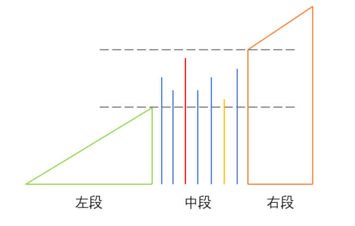
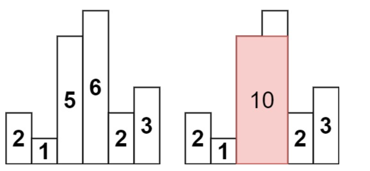

# 栈与队列

栈，后进先出(LIFO)；队列，先进先出(FIFO).

## 基本语法

#### collections.deque

双端队列，在两端插入和删除耗时$O(1)$, 想要取中间的元素则耗时$O(n)$. deque在内存中是不连续的，切片操作不允许。

``` python
d = deque([0,1,2]) # 传入参数可以是：list/set/string/tuple/dict(只会传入key)

d.append(3)           # deque([0,1,2,3])
d.appendleft('a')     # deque(['a',0,1,2,3])
d.extend('ll')        # deque(['a',0,1,2,3,'l','l'])
d.extendleft((1,0))   # deque([0,1,'1',0,1,2,3,'l','l'])

element = d.pop()     # deque([0,1,'1',0,1,2,3,'l']), element='l'
deque().pop()       # IndexError: pop from an empty deque
element = d.popleft() # deque([1,'1',0,1,2,3,'l']), element=0

d = deque([1,2,3], maxlen=3) # 指定了maxlen之后会自动溢出
d.append(4)           # deque([2,3,4])
d.appendleft(5)       # deque([5,2,3])

### list的方法同样适用
len(d)
d[-1]    # 没有deque.top()
d[:-1]   # TypeError: sequence index must be integer, not 'slice'
d.count(0)
d.index('l')
d.insert(0,'b')
d.remove('b')
d.clear()

d = deque([1,2,3,4,5])
d.rotate(2)   # rotate in clockwise, deque([4,5,1,2,3])
d.rotate(-3)  # rotate in anticlockwise, deque([2,3,4,5,1])
```

#### heapq

堆操作的类（默认创建小根堆），存储方式为数组，各种方法仅仅是在数组上做堆操作：index从0开始，节点heap[k]的左孩子heap[2k+1]，右孩子heap[2k+2]; 最后一个非叶子节点heap[n//2-1]. 用定义的插入和删除方法会自动维护堆 $O(logn)$.

```python
##### 创建一个小根堆 -> O(n)
# 1. 从空开始逐个heappush
a = []
heapq.heappush(a,1)             # [1]
heapq.heappush(a,18)            # [1,18], O(logn)
# 2. 从已有列表开始交换元素建堆
a = [18,1]                      # a=[(1,'a'),(2,'b')]也可以，会根据第一个元素排序
heapq.heapify(a)                # [1,18], O(n)
##### 创建一个大根堆
a = list(map(lambda x: -x, a))
heap.heapify(a)                 # [-18,-1]
a = list(map(lambda x: -x, a))  # [18,1]

##### pop堆顶
b = heapq.heappop(a)            # O(logn). 会维护堆的形状
b = a[0]                        # 获取堆顶，不pop

##### 为对象列表建堆
a = []
class Node:
    def __init__(self, val):
        self.val = val
    def __lt__(self, other):  # 定义比较器
        return self.val < other.val
heapq.heappush(a, Node(0))
```


## In total

1. 

## 问题

### 1.堆栈定义

> [232. Implement Queue using Stacks](https://leetcode.com/problems/implement-queue-using-stacks/description/)

​	(output stack) ][ (input stack)

Just like the above, two stacks can compose a queue, with the left one acting as `output stack` and the right acting as `input stack`. Each time an element is put in the queue, put it into the input stack, and whenever popping out an element, pop it from the output stack. When output stack is empty, pop all elements of input stack to the output stack one by one.

> [225. Implement Stack using Queues](https://leetcode.com/problems/implement-stack-using-queues/)

When input 1,2,3 -> stack: 3,2,1] , we should make the queue arrange like: 3,2,1

- input 1 -> `1`
- input 2 -> 1,`2` -> `2`,1
- input 3 -> 2,1,`3` -> 1,`3`,2 -> `3`,2,1

Whenever inputing an element in queue, pop and push the elements before it one by one.

>[155. 最小栈](https://leetcode.cn/problems/min-stack/) *

创建一个栈并能在常数时间内检索到最小值

**Solution 1: auxilary stack -> O(n) space complexity**

Once we input a num, we push the min value into the auxilary stack. Once we pop a num, we pop the auxilary stack too. The min value can be calculated by comparing the current num with the previous min value.

**解法2: 差值栈 -> O(1) 空间复杂度**

将`diff=val-minval`存入栈中。第一个元素的diff=0，当执行push操作，diff>=0直接入栈，<0的入栈同时更新`minval=val`；当执行pop操作，diff<0表示最小值被pop，返回minval并更新`minval-=diff`，当diff>=0，返回`diff+minval`.

> [295. 数据流的中位数](https://leetcode.cn/problems/find-median-from-data-stream/)

`用大根堆储存前一半数据，小根堆储存后一半数据，动态维持两个堆的长度相差1以内`。即两个堆的堆顶是相对的，每次pop都能找到最靠近中位数/对方的数字。

- **获取中位数 $O(1)$**：如果两堆数据一样多，则各取堆顶求和/2；如果其中一堆多，则中位数就是那个堆的堆顶。
- **插入数据 $O(logn)$**：若当前数据小于中位数，则插入大根堆，否则插入小根堆。每当插入，检查是否插入后堆长度相差>1，如果是，pop出长度大的堆顶插入另一个堆。
- 注意：用heapq维持大根堆的时候，对元素取反，因为默认是小根堆。

### 2.单调栈

单调栈维护一个元素单调递增/递减的栈，用于解决类`滑动窗口`的问题：

- 找到区间内更大/最大的元素，且这个元素有可能持续对后面多个元素有效
- 

技巧：

- 举个例子，手动入栈一遍看看
- 每个元素都至少需要入栈一次
- 不符合单调性的元素会被pop掉（之后不在用到）

> [239. 滑动窗口最大值](https://leetcode.cn/problems/sliding-window-maximum/)

用单调栈记录`可能的最大值`，维持一个单调递减的栈。例如, $1,3,6,2,5,1,7$; k=4.

- 按顺序入栈，当新进入的元素更大，持续pop掉原来的元素直到新的元素可以入栈；当新的元素更小，直接入栈
- 当已经遍历了k个元素，考虑滑动窗口，将一些不在窗口内的大元素从栈底pop出（deque实现）。
- 栈中记录的是index，这样才方便比较是否还在窗口内。

> [503. 下一个更大元素 II](https://leetcode.cn/problems/next-greater-element-ii/)

仍然是**滑动窗口问题**：当搜索更大的数，窗口向右扩展；当左边的最大数已确定，窗口收缩。

单调递减栈内记录没有找到下一个最大的元素，当更大的元素进入，前面的元素被pop掉，此时这些元素的下一个更大元素就被更新为新进入的元素。

- 将ans数组初始化为-1，因为最大的元素永远不会被更新到
- 遍历数组两次 `for i in range(2*n-1)`
- 用%运算获得index，并在st中记录index

```python
while stk and nums[stk[-1]] < nums[i % n]:
    ret[stk.pop()] = nums[i % n]
stk.append(i % n)
```

> [316. Remove Duplicate Letters](https://leetcode.com/problems/remove-duplicate-letters/)

1. Keep the ascending sequence of the stack.
2. Remove the duplicate elements in the stack.

Use a dict to count the **remaining element c nums** to decide whether to pop the element c in stack. Use a set to record the existing elements in the stack, so **do not push in when c is already in stack**.

> [581. 最短无序连续子数组](https://leetcode.cn/problems/shortest-unsorted-continuous-subarray/) *

###### monotonic stack -> $O(2n)$

**Left boundary**: searching from left to right, use an ascending stack to keep the sequence and find the minimum index of the popped elements.

**Right boundary**: searching from right to left, use a descending stack to keep the sequence and find the maximum index of the popped elements.

**Popped elements**: the ones that not in order.

###### 双指针 -> $O(n)$



- 中间无序部分的最小和最大值，一定大于左段小于右段；且最小值不在最左，最大值不在最右。
- 从左到右扫描并维护当前最大值maxn，如果遇到比maxn小的，代表开始乱序，记录它为可能的右边界。当走到右段，一定大于中段最大值，maxn会继续更新。
- 从右到左扫描并维护当前的最小值minn，如果遇到比minn大的，代表开始乱序，记录它为可能的左边界。当走到左段，一i的那个小于minn，继续更新。

> [84. 柱状图中最大的矩形](https://leetcode.cn/problems/largest-rectangle-in-histogram/) *



**Brute Force:** 

- enumerate weights -> find the maximum area in the given weight

- enumerate heights -> find the left and right bounds that can maintain the given bounds

**解法2：单调栈**

枚举高度，往左右拓展，查找每个高度的最大面积。

- height[i]的左边界：从左到右遍历，找到每个柱子左边第一个小于自己的柱子并记录 -> 递增的单调栈。右边同理。
- 时间复杂度：$O(n)$, 空间复杂度：$O(n)$.

**优化**

一次遍历获取每个height[i]的左右边界。

- 模拟单调栈找规律：当用递增单调栈，pop出元素i的时候，当前栈顶的元素就是i柱子的左边最小，而即将入栈的元素就是右边最小。
- 在height数组右边添加0，st初始化为[-1]来减少额外的判断。

> [85. 最大矩形](https://leetcode.cn/problems/maximal-rectangle/)

84题的二维版本，即矩阵的每一行都是一个x轴，上面有一些柱状图需要计算面积