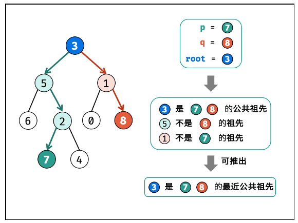

# 二叉树

二叉树是一种数据结构，每个节点只能有至多两个子节点，命名为左孩子、右孩子。

- **满二叉树**：k层二叉树(1~k)，节点的总数是$2^k-1$.

- **完全二叉树：**满二叉树最后一层的右边部分缺失，其余与满二叉树一致。

  - 完全二叉树有如下性质：设$n_0$为叶子结点数量，$n_1$为只有一个孩子节点的节点数量，$n$为总节点数量

  - $$
    n_0=\frac{n+1-n_1}{2} \\
    n-n_0=\frac{n+n_1-1}{2}=n//2
    $$

## 基本语法

### 遍历二叉树

- **前序遍历**: 根左右
- **中序遍历**: 左根右
- **后序遍历**: 左右根
- **层序遍历**: 逐层遍历

``` python
## 定义树节点
class TreeNode:
    def __init__(self, val=0, left=None, right=None):
        self.val = val
        self.left = left
        self.right = right
        
## 递归：前中后序遍历都比较一致
## 时间复杂度: O(n), 空间复杂度: 至多O(n)(单链表), 平均O(logn) (==O(height))
def inorderTraversal(root):
    if not root: return []
    ans = []
    ans.extend(self.inorderTraversal(root.left))
    ans.append(root.val)
    ans.extend(self.inorderTraversal(root.right))
    return ans

## 迭代: 需要用到栈
## 时间复杂度: O(n), 空间复杂度: 至多O(n), 平均O(logn)
def PreOrderTraversal(root):
    ## version 1：根右左
    if not root: return []
    ans = []
    stack = deque([root])
    while stack:
        node = stack.pop()
        ans.append(node.val)                  
        if node.right: stack.append(node.right)  # 先放右儿子
        if node.left: stack.append(node.left)    # 再放左儿子
    return ans
		## version 2
	if not root: return []
    st = []
    ans = []
    node = root
    while st or node:
        while node:
            ans.append(node.val)
            st.append(node)
            node = node.left
        node = st.pop().right
    return ans
def InOrderTraversal(root):
    if not root: return []
    ans = []
    stack = deque([])
    node = root
    while stack or node:
        while node:
            stack.append(node)
            node = node.left
        node = stack.pop()      # 找到最左下的节点
        ans.append(node.val)    # 访问该节点
        node = node.right
    return ans
def PostOrderTraversal(root):
    ## version 1
    if not root: return []
    ans = []
    stack = deque([root])
    cur = root
    while stack:
        node = stack[-1]
        # if right is the last visited, left is also visited
        if node.left and node.left != cur and node.right != cur:
            stack.append(node.left)
        elif node.right and node.right != cur:
            stack.append(node.right)
        else:
            ans.append(stack.pop().val)
            cur = node                  # cur means the last visited.
    return ans
	## version 2: 左右根 == reversed(根右左)
    if not root: return []
    stack = deque([root])   
    ans = []
    while stack:
        node = stack.pop()
        ans.append(node.val)
        if node.left: stack.append(node.left)    # 先放左边
        if node.right: stack.append(node.right)  # 再放右边
    ans.reverse()
    return ans
## level order -> BFS -> queue
def levelOrder(root):
    if not root: return []
    queue = deque([root])
    ans = []
    while queue:
        size = len(queue) # 记录每层的sizel
        level = []
        for i in range(size):
            node = queue.popleft()
            level.append(node.val)
            if node.left: queue.append(node.left)
            if node.right: queue.append(node.right)
        ans.append(level)
    return ans
```

**Morris traversal**:

For each root node, connect its rightest node of the left tree to it.

Time complexity $O(n)$, Space complexity $O(1)$.


```python
def Morris(root):
    if not root: return []
    cur1, cur2 = root, None
    # preOrderAns = []   # appended when 1. one root is first connected 2. the leaf node is added.
    while cur1:
        cur2 = cur1.left
        if cur2:
            while cur2.right and cur2.right != cur1:
                cur2 = cur2.right
            if cur2.right == None:
                cur2.right = cur1
                # preOrderAns.append(cur1.val)
                cur1 = cur1.left
                continue
            else:
                cur2.right = None   # if the root is already connected,
        cur1 = cur1.right            
```


## 通用思路

1. 初始判断: `root==None` 

2. 考虑条件: `node.left == None`, `node.right == None`

   

## 问题

### 处理二叉树

基础操作是**遍历和处理**，因此需要选择一种便于处理数据的遍历方式。通常来说，前序遍历（先处理数据后遍历子树，自顶向下）和后序遍历（先遍历再处理，自底向上）方法比较常用。

遍历技巧:

- **自顶向下**: 需要将值作为参数向下传递
- **自底向上**: 需要整合左右子树的返回值

处理技巧:

- 可以同时传递左右两个节点

- 计算高度和判断平衡可以同时进行

#### 递归方法

> [101. 对称二叉树](https://leetcode.cn/problems/symmetric-tree/) *

**DFS: 每次递归处理l,r两个节点**

```python
def isSymmetric(root):
    if not root: return True
    def dfsCompare(l, r):
        if not l and not r: return True  # when l==r==None, return True
        if not l or not r: return False  # when one of nodes is None, return False 
        if l.val != r.val: return False  # when nodes.val are not equal, return False
        # compare the four children, sides with sides, centor with centor
        return dfsCompare(l.left, r.right) and dfsCompare(l.right, r.left)
    return dfsCompare(root.left, root.right)
```

**BFS: 每次迭代pop和处理两个节点**

```python
def isSymmetric(root):
    if not root: return True
    q = deque([root.left, root.right])
    while q:
        l, r = q.popleft(), q.popleft()
        if not l and not r: continue
        if not l or not r: return False
        if l.val != r.val: return False
        ## push in the queue in the corresponding manner.
        q.append(l.left)
        q.append(r.right)
        q.append(l.right)
        q.append(r.left)
    return True
```

> [110. 平衡二叉树](https://leetcode.cn/problems/balanced-binary-tree/)

平衡二叉树需要满足：

- 左右子树都是平衡二叉树
- 左右子树高度差<=1

自底向上的方法。

> [257. Binary Tree Paths](https://leetcode.com/problems/binary-tree-paths/description/)

For this problem, you need traverse and keep the path recorded.

- DFS: pass the path `p=''` as a parameter during recurse.(p can keep the local status in a recurse function)
- BFS: keep a path queue, copy the path and create the new one when meets different branches.

All these two methods cost $O(n^2)$ time complexity: traverse $O(n)$ **plus** copy the path $O(n)$; and $O(n^2)$ space complexity

> [437. 路径总和 III](https://leetcode.cn/problems/path-sum-iii/)

**Solution 1: Brute Force** $O(n^2), O(n^2)$

It is quite like given an array to find subarray nums of targeted sum. We enumerate the right boundary and for each right enumerate the left boundary. $O(n^2)$

We just change it to the tree structure. During each dfs(root, target), we return the number of paths (`starts with root`) sum up to target. For each node, we need to consider the situation that it serves as start node of the path. Thus we need a dfs in dfs.

**解法2: 树形前缀和** $O(n), O(n)$

自顶向下。


==Prefix method==: we can construct a dict to store the prefix and the time that it appears(useful for a fix target, if it requires the max target, use dp like 124.). `dic[prefix]: freq`. Thus we only need to enumerate the ==right boundary== `r`. For each [0:r+1], we need to find the possible `l` that [l:r+1] sums up to target -> find the possible `l` that [0:l] sums up to `prefix_r - target`.

For tree structure is the same. Remember to remove the prefix of current node in dict before it returns.

> [124. 二叉树中的最大路径和](https://leetcode.cn/problems/binary-tree-maximum-path-sum/) *

Similar to 437, but it's a dp problem. ==The maximum sum can not use prefix method==. 

- $dp[i] = nums[i] + max(0, dp[i-1])$
- dp[i] means the max sum of nums[k:i], k ranges in [0,i]

For the tree, to obtain a max sum that contain the current node, `dp[cur]=node.val + max(0,dp[node.left]) + max(0,dp[node.right])`. The value of dp is the return value during the DFS.

To return the correct value to the father node, current node must only contain one side of the path. `ret = node.val + max(left_ret,right_ret,0)`.


> [513. Find Bottom Left Tree Value](https://leetcode.com/problems/find-bottom-left-tree-value/description/)

The bottom left node is the most left node in the deepest row. We need to traverse the whole tree to find the answer. The minimum time complexity is $O(n)$

- DFS: need to record the max depth and the ans val during traversal. But for recursive method, the variable inside the function can only keep the relevant depth not the global one. So an nonlocal announce is necessary. 
- BFS: an easier way is to append from right to the left, then the last node is the answer.

> [199. Binary Tree Right Side View](https://leetcode.com/problems/binary-tree-right-side-view/)

Also need to traverse the whole tree.

- DFS: we can first visit right son then left son. For every depth of the tree, the first node is the answer.
- BFS: recored the last node of the each layer.

#### Iterative methods

> [114. Flatten Binary Tree to Linked List](https://leetcode.com/problems/flatten-binary-tree-to-linked-list/)

**Solution 1: from top to bottom** $O(n), O(1)$

For each node, we find its(`root`) left son's rightest node(`node`) and make `node.right = root.right`. Then put the root's left son to the right and make the left son zero. Repeat this process in each node.

**Solution 2: from bottom to top** $O(n),O(n)$

For preOrder, the reverse is right-left-current. We dfs the tree according to the reverse order. For each current node, we point its right pointer to its previous(need to be recorded globaly), and the left pointer to None.

#### Special Trees

> [222. Count Complete Tree Nodes](https://leetcode.com/problems/count-complete-tree-nodes/description/)

**Properties of complete tree:**

- For a root node, the height of left and right sub-trees are `l` and `r`:
  - if `l == r`: left tree must be a full tree
  - if `l > r`: right tree must be a full tree

For problem 222, just recursively find the full sub-trees. If left is subtree, the number of left-tree nodes are $2^l-1$. Then just need to count the number of nodes of the right sub-tree.

### Construct binary tree

> [106. Construct Binary Tree from Inorder and Postorder Traversal](https://leetcode.com/problems/construct-binary-tree-from-inorder-and-postorder-traversal/description/)

Given an inorder and pre/postorder traversal, one can reconstruct the binary tree. We can **construct the structure** according to the **inorder list** and **get the val** from the **pre/postorder** list.

- Create a dict to map the val and index of the inorder.

  ```python
  dic = {val:i for i,val in enumerate(inorder)}
  ```

- Pop the root from the back of the postorder list/start of the preorder list. 

- Find the index of root, and split it into left and right sub-trees. 

- When popping from postorder, first reconstruct the right sub-tree; when popping from the preorder, first reconstruct the left sub-tree.

- Judge the None node: left > right.

> [654. Maximum Binary Tree](https://leetcode.com/problems/maximum-binary-tree/description/)

Construct a binary tree according to the maximum number. Find the maxnum in the left part and right part -> **Monotonic stack**(descending order).


### Binary Search Tree(BST)

The root value is **greater than(>)** all the left subtree nodes' value, and **less than(<)** all the right subtree nodes' value. All the subtrees satisfy this condition.

- Insert/Delete complexity: $O(logn)$, no need dfs to get the specific element.
- The **InOrderTraversal** of BST is in strictly ascending order.

> [98. Validate BST](https://leetcode.com/problems/validate-binary-search-tree/description/) *

- Solution1: Pass `l` and `r` during the recursive traversal to validate all the nodes' val are inside (l,r). When passing down the tree, the possible nums range [l,r] shrinks.
- Solution2: make sure the **inorder traversal** is in the strictly ascending order. -> keep previous node recorded(outside the dfs function) and validate current val > previous val.

> [236. LCA of a Binary Tree](https://leetcode.com/problems/lowest-common-ancestor-of-a-binary-tree/description/) *



###### **Properties of LCA:**

If root is the LCA of p,q, it must be one of the following conditions:

- root is the LCA, and p,q in the left and right subtrees seperately.在两条路径中
- root is the LCA, and root is p or q, the other is in one of the two subtrees.在一条路径中

So once we meet p and `p == root.left`, q can be in the right subtree or left subtree. If in the left, just return p, no need to locate q; if in the right, just return the root. We can judge where q is from whether dfs(root.right, p, q) find q.

> [669. Trim a Binary Search Tree](https://leetcode.com/problems/trim-a-binary-search-tree/description/)

- For root.val < low: the root and root.left need to be trimmed.

- For root.val > high: the root and root.right need to be trimmed.

> [96. Unique BSTs](https://leetcode.com/problems/unique-binary-search-trees/description/), Find out the number of unique BSTs given values 1-n.

- Solution1: dfs. $numroot$ represents the BSTs num of a given root. There is $numroot = numleft*numright$. So the answer of n is $num1 + num2 + ... + numn$.

- Solution2: dp. The dfs method can be optimized as the num of smaller value are calculated repeatedly during the dfs. The answer is only about the number, not the value.

  - eg, when n=3, root=1, num1 = the result of n=2.

    