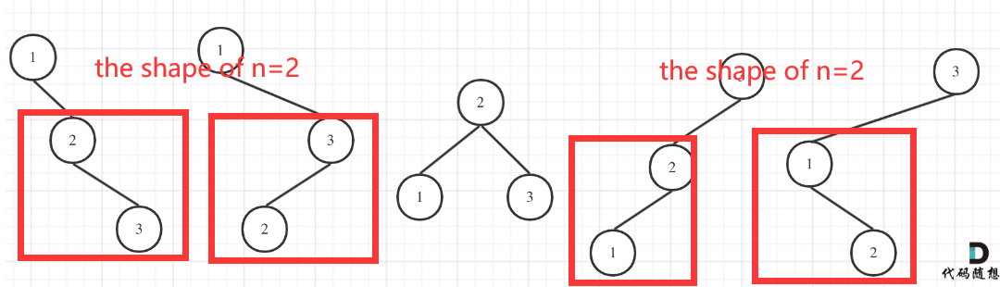

# 二叉树

二叉树是一种数据结构，每个节点只能有至多两个子节点，命名为左孩子、右孩子。

- **满二叉树**：k层二叉树(1~k)，节点的总数是$2^k-1$.

- **完全二叉树：**满二叉树最后一层的右边部分缺失，其余与满二叉树一致。

  - 完全二叉树有如下性质：设$n_0$为叶子结点数量，$n_1$为只有一个孩子节点的节点数量，$n$为总节点数量

  - $$
    n_0=\frac{n+1-n_1}{2} \\
    n-n_0=\frac{n+n_1-1}{2}=n//2
    $$

## 基本语法

### 遍历二叉树

- **前序遍历**: 根左右
- **中序遍历**: 左根右
- **后序遍历**: 左右根
- **层序遍历**: 逐层遍历

``` python
## 定义树节点
class TreeNode:
    def __init__(self, val=0, left=None, right=None):
        self.val = val
        self.left = left
        self.right = right
        
## 递归：前中后序遍历都比较一致
## 时间复杂度: O(n), 空间复杂度: 至多O(n)(单链表), 平均O(logn) (==O(height))
def inorderTraversal(root):
    if not root: return []
    ans = []
    ans.extend(self.inorderTraversal(root.left))
    ans.append(root.val)
    ans.extend(self.inorderTraversal(root.right))
    return ans

## 迭代: 需要用到栈
## 时间复杂度: O(n), 空间复杂度: 至多O(n), 平均O(logn)
def PreOrderTraversal(root):
    ## version 1：根右左
    if not root: return []
    ans = []
    stack = deque([root])
    while stack:
        node = stack.pop()
        ans.append(node.val)
        if node.right: stack.append(node.right)  # 先放右儿子
        if node.left: stack.append(node.left)    # 再放左儿子
    return ans
	## version 2
	if not root: return []
    st = []
    ans = []
    node = root
    while st or node:
        while node:
            ans.append(node.val) # 先访问当前node
            st.append(node)      # 当前node入栈
            node = node.left
        node = st.pop().right    # 最左节点的右孩子入栈
    return ans
def InOrderTraversal(root):
    if not root: return []
    ans = []
    stack = deque([])
    node = root
    while stack or node:
        while node:
            stack.append(node)
            node = node.left
        node = stack.pop()      # 找到最左下的节点
        ans.append(node.val)    # 访问该节点
        node = node.right       # 准备从最左节点的右孩子开始遍历
    return ans
def PostOrderTraversal(root):
    ## version 1
    if not root: return []
    ans = []
    stack = deque([root])
    cur = root # cur表示上一个加入ans的节点，初始化为root
    while stack:
        node = stack[-1]
        # 如果右孩子已经加入ans，那左孩子必然也已经加入ans，则无需继续往下遍历
        if node.left and node.left != cur and node.right != cur:
            stack.append(node.left)
        elif node.right and node.right != cur:
            stack.append(node.right)
        else:
            ans.append(stack.pop().val)
            cur = node                  # 更新cur
    return ans
	## version 2: 左右根 == reversed(根右左)
    if not root: return []
    stack = deque([root])   
    ans = []
    while stack:
        node = stack.pop()
        ans.append(node.val)
        if node.left: stack.append(node.left)    # 先放左边
        if node.right: stack.append(node.right)  # 再放右边
    ans.reverse()
    return ans
## level order -> BFS -> queue
def levelOrder(root):
    if not root: return []
    queue = deque([root])
    ans = []
    while queue:
        size = len(queue) # 记录每层的sizel
        level = []
        for i in range(size):
            node = queue.popleft()
            level.append(node.val)
            if node.left: queue.append(node.left)
            if node.right: queue.append(node.right)
        ans.append(level)
    return ans
```

**Morris traversal**:

对于每个根节点，让其左子树的最右节点指向它。$O(n),O(1)$


```python
def Morris(root):
    if not root: return []
    cur1, cur2 = root, None
    # preOrderAns = []   # appended when 1. one root is first connected 2. the leaf node is added.
    while cur1:
        cur2 = cur1.left
        if cur2:
            while cur2.right and cur2.right != cur1:
                cur2 = cur2.right
            if cur2.right == None:
                cur2.right = cur1
                # preOrderAns.append(cur1.val)
                cur1 = cur1.left
                continue
            else:
                cur2.right = None   # if the root is already connected,
        cur1 = cur1.right            
```


## 通用思路

1. 初始判断: `root==None` 

2. 考虑条件: `node.left == None`, `node.right == None`

   

## 问题

### 一、处理二叉树

基础操作是**遍历和处理**，因此需要选择一种便于处理数据的遍历方式。通常来说，前序遍历（先处理数据后遍历子树，自顶向下）和后序遍历（先遍历再处理，自底向上）方法比较常用。

遍历技巧:

- **自顶向下**: 需要将值作为参数向下传递
- **自底向上**: 需要整合左右子树的返回值

处理技巧:

- 可以同时传递左右两个节点
- 计算高度和判断平衡可以同时进行
- 可以设置cnt，pre等全局变量记录遍历过程的信息，此变量不受递归回溯过程的影响

#### 递归法

> [101. 对称二叉树](https://leetcode.cn/problems/symmetric-tree/) *

**DFS: 每次递归处理l,r两个节点**

```python
def isSymmetric(root):
    if not root: return True
    def dfsCompare(l, r):
        if not l and not r: return True  # when l==r==None, return True
        if not l or not r: return False  # when one of nodes is None, return False 
        if l.val != r.val: return False  # when nodes.val are not equal, return False
        # compare the four children, sides with sides, centor with centor
        return dfsCompare(l.left, r.right) and dfsCompare(l.right, r.left)
    return dfsCompare(root.left, root.right)
```

**BFS: 每次迭代pop和处理两个节点**

```python
def isSymmetric(root):
    if not root: return True
    q = deque([root.left, root.right])
    while q:
        l, r = q.popleft(), q.popleft()
        if not l and not r: continue
        if not l or not r: return False
        if l.val != r.val: return False
        ## push in the queue in the corresponding manner.
        q.append(l.left)
        q.append(r.right)
        q.append(l.right)
        q.append(r.left)
    return True
```

> [110. 平衡二叉树](https://leetcode.cn/problems/balanced-binary-tree/)

平衡二叉树需要满足：

- 左右子树都是平衡二叉树
- 左右子树高度差<=1

自底向上的方法。

> [437. 路径总和 III](https://leetcode.cn/problems/path-sum-iii/)

**树形前缀和** $O(n), O(n)$

自顶向下，和560题一样记录前缀和，不同的是在计算前缀和的时候，`只能累计一条树枝`，当遍历到右子树的时候，需要从mp中减去左子树的前缀和。

> [124. 二叉树中的最大路径和](https://leetcode.cn/problems/binary-tree-maximum-path-sum/) *

**树形最大子数组和，dp**

- $dp[i] = nums[i] + max(0, dp[i-1])$
- dp[i]代表以i节点为根，向下的`单条分支`的最大和；包含节点i的路径由左边的分支和右边的分支加起来得到
- `ans=node.val + max(0,dp[node.left]) + max(0,dp[node.right])`，dp值即为dfs的返回值

> [199. 二叉树的右视图](https://leetcode.cn/problems/binary-tree-right-side-view/) *

需要遍历整棵树。

- **DFS**：先遍历右子树，再左子树。对`每个深度，第一个进入该深度节点`就是答案。
- **BFS**：每一层的最后一个节点就是答案。

> [236. 二叉树的最近公共祖先](https://leetcode.cn/problems/lowest-common-ancestor-of-a-binary-tree/) *


###### **LCA的性质:**

如果当前root是p,q节点的LCA，它必定是下面两种情况之一：

- root是LCA，且p,q分别在左右子树 —— p,q在两条路径中
- root是LCA，且root是p或者q，另一个节点在其中一个子树中 —— p,q在一条路径中

**解法：**

- 自底向上遍历二叉树，当遇到p或者q直接返回。如果某个root的左右子树分别返回了p,q，表示当前root就是LCA；如果一直到根节点仍有一个子树返回None，代表另一个子树返回的p就是LCA。

#### 迭代法

> [114. 二叉树展开为链表](https://leetcode.cn/problems/flatten-binary-tree-to-linked-list/) *

**解法1：自顶向下 **$O(nlogn), O(1)$

- 对于每个节点，把其`右子树`作为`左子树最右下节点`的右孩子；再将左子树移到右边，左子树置空。迭代法。

**解法2：自底向上 $O(n),O(n)$**

- 要求以`根左右`的顺序展开为链表，那可以以`右左根`的顺序从链表尾部开始构建。

- 找规律可以发现，遍历到当前节点时，把`遍历的上一个节点(pre)`插入到自己右孩子处，并把左孩子置空即可满足要求（此时当前节点的左孩子已经是单链表了，右孩子已经无用）。
- 用全局pre记录遍历的上一个节点。

### 二、构造二叉树

> [106. 从中序与后序遍历序列构造二叉树](https://leetcode.cn/problems/construct-binary-tree-from-inorder-and-postorder-traversal/) *

给定中序和前/后序遍历，我们可以还原出二叉树。根据中序的所提供的节点的位置关系信息，从前/后序中按顺序拿到节点值来构建。

- 根据中序list创建字典将index和下标关联起来

  ```python
  dic = {val:i for i,val in enumerate(inorder)}
  ```

- 从前/后序遍历中`按顺序`弹出节点

- 找到节点的index，划分index左右两边作为左右子树

- 从`前序`构造的时候，先构造`左子树`；从`后序`构造的时候，先构造`右子树`

- 判断空节点：l>r —— l,r的作用就是填入未写在顺序中的空节点

> [654. 最大二叉树](https://leetcode.cn/problems/maximum-binary-tree/) *

Construct a binary tree according to the maximum number. Find the maxnum in the left part and right part -> **Monotonic stack**(descending order).


### 三、特殊的树

#### 3.1 二叉搜索树(Binary Search Tree, BST)

根节点的值`大于所有`左子树节点的值，`小于所有`右子树节点的值，且所有子树也都是二叉搜索树。

- 插入/删除/查询时间复杂度：$O(logn)$，寻找位置的时候只需要遍历一半的子树
- BST的中序遍历是严格递增的序列

> [98. 验证二叉搜索树](https://leetcode.cn/problems/validate-binary-search-tree/) **

- **解法1，自顶向下**：dfs的时候传递l，r作为参数，验证所有的元素是否在[l:r]中。当向下传递，[l:r]收缩。
- **解法2，中序遍历**: 保证中序遍历的序列是升序的. -> 在dfs之外记录前一个节点的值pre。

> [230. 二叉搜索树中第 K 小的元素](https://leetcode.cn/problems/kth-smallest-element-in-a-bst/)

- ==二叉搜索树中序遍历 == 严格升序序列==，因此直接cnt记录中序遍历时的顺序，到k的时候直接打断。
  - 注意dfs时，cnt需要是全局变量

> [669. Trim a Binary Search Tree](https://leetcode.com/problems/trim-a-binary-search-tree/description/)

- For root.val < low: the root and root.left need to be trimmed.

- For root.val > high: the root and root.right need to be trimmed.

> [96. 不同的二叉搜索树](https://leetcode.cn/problems/unique-binary-search-trees/) * 给定数值1~n，找出不同的BST数目

**解法1：DFS**

- 考虑1-n中`每个数字作为根节点numn`可能构造的BST数量，numn=numl*numr。因此答案是num1+num2+...+numn.

**解法2：DP**

- 根据DFS的思路可以知道，numn可以拆解为子问题numl的积。如下图，n=3的时候，当以1和3为根节点，剩余的2个节点组成的BST数量就是n=2时候的BST数量。

- dp[i]: 1-i的数字能组成的BST的数量

- $dp[i]=dp[0]*dp[i-1]+dp[1]*dp[i-2]+...+dp[i-1]*dp[0]$

- dp[0]=1,dp[1]=1

  ```python
  for i in range(2,n+1):
  	for j in range(i):
  		dp[i] += dp[j]*dp[i-j-1]
  ```

  

#### 3.2 满/完全二叉树

> [222. Count Complete Tree Nodes](https://leetcode.com/problems/count-complete-tree-nodes/description/)

**Properties of complete tree:**

- For a root node, the height of left and right sub-trees are `l` and `r`:
  - if `l == r`: left tree must be a full tree
  - if `l > r`: right tree must be a full tree

For problem 222, just recursively find the full sub-trees. If left is subtree, the number of left-tree nodes are $2^l-1$. Then just need to count the number of nodes of the right sub-tree.