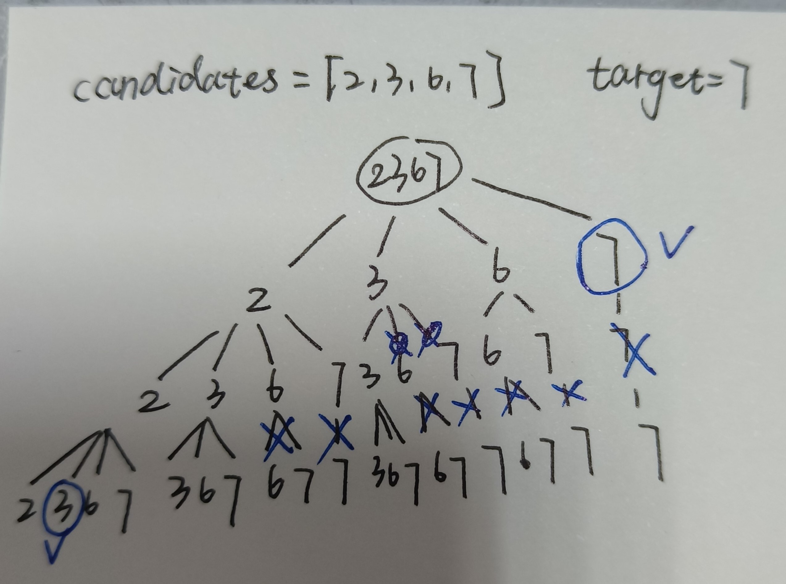

# 回溯

回溯算法是DFS的一种，可以将问题建模成一颗树（不一定是二叉树），在树上DFS。

## 通用思路

1. 对于一个示例输入（复杂一点），画一棵树
2. 如何停止递归？-> 记录树的深度
3. 如何剪枝？-> 在某些条件下提前返回

### 模板

```python
def backtracing(params):
    if end_condition:
        processing
    for i in sons_of_the_father_node:
        processing
        backtracing(modified_params)
        processing
```

### 技巧

- **提前排序**：排序的时间复杂度$O(n^2)$比回溯时间复杂度$O(2^n*n)$要低得多，提前排序是可以接受的

## 题目

回溯题目包括以下几类：

- 计算所有的组合：组合的不同下标作为不同层。第一层：组合中的第一个数
- 分割字符串，返回所有分法：分割次数作为不同层。第一层：第一次分割，s[0:i]，每个不同的i都是第一层中不同的结点
- 需要遍历并返回所有结果的问题

> [216. 组合总和 III](https://leetcode.cn/problems/combination-sum-iii/)

解析题目：从1-9中选择k个不重复的数字，和为n

做法：构建一个k层，第一层9个node的树

- **自顶向下**的方法：需要用path动态地记录当前的组合

  ```python
  ans,path = [],[]
  def dfs():
    if xxx:
      ans.append(path.copy())
    for i in nodes:
      path.append(i)
      dfs()
      path.pop()
  ```

  - 剪枝：画树的时候可以分析出来
    - 不能重复取数字：每次到下一层时，仅遍历父节点后面的数字
    - 当前和小于target：target作为参数传入，判断target>=0

- **自底向上**的方法：需要遍历所有叶子结点（不能剪枝）

> [39. 组合总和](https://leetcode.cn/problems/combination-sum/)

解析题目：从不重复正数list中选择数字（可重复选择），和为target

- 和216的不同之处在于：

  - path的长度不固定 

    - 因为没有负数和0，一直dfs直到大于等于target就可以停止该分支的搜索了

  - [1,1,2],[1,2,1],[2,1,1]是重复的，需要去重

    - 在同一层遍历的时候，后面node的子结点遍历，不应包括前面的结点。因为在前面结点遍历的时候，已经把包括自己的可能组合全部遍历过了。如下图：

      

    - 也可以使用一个set记录当前的元素是否被遍历过

**技巧：**对于组合问题，去重 -> ==按顺序遍历==

> [47. 全排列 II](https://leetcode.cn/problems/permutations-ii/)

解析题目：去重，在每一层，选过的数字不再选；但是在纵向path中，可能出现重复的数字

- 为了给结果去重，需要保证每一层选择的数字是不同的，因此在每个dfs遍历层node之前，设置一个visited set记录已经选择过的值

- 由于候选list中有重复，每次选择只是去掉了list中的某个index，它所对应的值仍然可以再被选择
  - 设置一个set choices表示可供选择的index，每次从choices中遍历node
    - choices随着path的深入而减少; 在遍历的过程中，为了避免choices的改变影响遍历，提前copy一份不变的choices

> [79. 单词搜索](https://leetcode.cn/problems/word-search/)

图的DFS, 从某个位置(i,j)开始，按照四个方向`directions = [(0,1),(0,-1),(1,0),(-1,0)]`遍历。

- **二维表DFS通用条件**：判断当前new_i,new_j是否超出边界，用visited判断当前位置是否已遍历过

- 此题条件：判断当前位置是否满足单词关系，判断当前位置是否已找到单词

在最开始进入dfs时，从(0,0)到(m-1,n-1)遍历；返回时，正常返回False；遇到满足条件的情况返回True。

> [200. 岛屿数量](https://leetcode.cn/problems/number-of-islands/)

每个dfs寻找一个岛屿，遍历二维数组中每个起始位置。

遍历过的岛屿更改数值为2，此时0表示海水，1表示未遍历的岛屿区域，2表示遍历过的岛屿区域

**岛屿数量**

- 计算 dfs返回True的次数

**最大岛屿面积**

- 累积面积area，遍历过程中更新`ans = max(ans,area)`

**岛屿周长**

- 累积周长，遍历过程中更新。注意，每次走到岛屿边界（网格边界或者沿海区域），周长+1.

```python
directions = [(0,1),(0,-1),(1,0),(-1,0)]
def dfs(i,j):
  if i < 0 or i >= m or j < 0 or j >= n:
    return False
  if grid[i][j] != 1:
    return False
  
  grid[i][j] = 2
  for dx,dy in directions:
    x,y = i+dx,j+dy
    ret = dfs(x,y)
    if ret:
      return True
  return False
```

> [51. N-Queens](https://leetcode.com/problems/n-queens/)

Typical problem, draw the backtrace tree and pruning. Each tree layer represents one row in the chessboard. -> $O(n!), O(n)$

- **Column**: record the columns that are already put in Queens.
- **Diagonal 1**: record the diagonals(from left top to right bottom) that are already put in Queens. The **difference between row and column** indexes of one grid is fixed in the same diagonal.
- **Diagonal 2**: record the diagonals(from left bottom to right top) that are already put in Queens. The **sum of row and column** indexes of one grid is fixed in the same diagonal.

We can use set or bit operation to record the three conditions.

> [37. Sudoku Solver](https://leetcode.com/problems/sudoku-solver/description/)

Difficulties:

- How to traverse: **create a spaces list** to record the spaces that need to fill in. Cause every space is a equivalent node, the backtrace tree is a single branch tree in this problem.
- How to turn (row,column) into block id: create **a three-dimensional array blocks**, with `blocks[row//3][column//3]` representing the corresponding block of space (i,j).