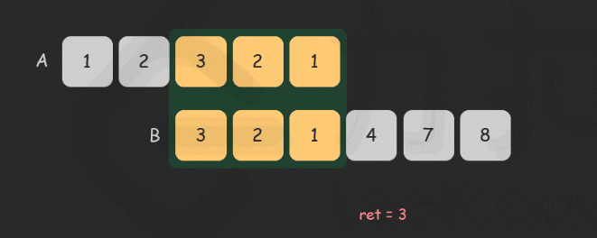

# 动态规划

动态规划（DP，Dynamic Programing）一种将复杂问题递归地拆解成**简单子问题**的算法，需要**记录子问题的答案**去避免重复计算。

- DP可以避免递归过程中对某个子问题的重复计算
- 记忆化搜索：DP的实现方法之一，回溯+记录计算结果

DP的实现有两种：1. 包含记忆化搜索(`@cache`)的回溯（从底向上） 2. 记忆化地迭代（从顶向下）

在python中，`@cache`装饰器可以记录函数的计算结果，在dfs函数前加上`@cache`能够很方便地帮助我们实现记忆化搜索。

## 通用思路

1. 创建list dp[]去记录结果
2. 定义状态 -> dp[i]的含义
3. 归纳状态转移函数 -> 枚举归纳法
4. 初始化dp[]
5. 填充dp[]，返回dp[n]

### 技巧

- 

## 问题

### 1. 经典DP问题

#### 一维DP， `dp[]`

此类题目主要是前缀/后缀之间的转移

- 子数组类题目：若`子数组和固定`（比如为k，为0），则考虑map记录前缀和；若`子数组和不固定`，考虑用线性dp找状态方程。

> [70. 爬楼梯](https://leetcode.cn/problems/climbing-stairs/) / 斐波那契数列

- **dp[i]**: 到达第i层时的方法数
- **状态转移方程**: dp[i] = dp[i-1] + dp[i-2]. dp[i]只依赖于前两个数，因此只需len(dp)=2记录前两个数
- **初始化**: dp[0]=1代表原地不动，dp[1]=1代表到达一层

> [560. 和为 K 的子数组](https://leetcode.cn/problems/subarray-sum-equals-k/) *

这种求固定和的子数组数量/长度，用==前缀和dp[i]==。

此题用hashmap{prefixsum: count}记录前缀和以及其对应的数量。

- 当遍历到index i，我们想知道**以i结尾的子数组**有多少个和为k，即需要找子数组[j:i+1]，如果dp[i]-dp[j]==k, ans += 1. 但遍历j效率太低，我们把i之前所有前缀和记录下来，只需要知道满足`dp[j]==dp[i]-k`的数量就好。

- 因此以dp[i]结尾的和为k的子数组数量即为，hashmap中前缀和为dp[i]-k的数量。
- 注意hashmap的初始化需要包括hashmap[0]=1，表示前缀和为0的index存在。

> [53. 最大子数组和](https://leetcode.cn/problems/maximum-subarray/)

此题由于和不确定，用前缀和也是要$O(n^2)$

**解法1: DP -> $O(n),O(n)$** 

- dp[i+1]：以i结尾的子数组最大和
- 状态转移方程：dp[i+1] = max(dp[i],0)+nums[i]
- 初始化：dp[0]=-inf, dp[1]表示nums[0]结尾

**解法2: 贪心 ->$O(n),O(1)$**

在遍历过程累加，并更新ans。一旦累加的count<0，则表示当前nums[i]是一个负数，且加上前面所有连续正数仍是负数，继续累加只会让后面的和变小，所以直接舍弃，令count=0.

```python
ans = float('-inf')
count = 0
for num in nums:
    count += num
    ans = max(ans,count)
    if count < 0: count = 0
return ans
```

> [32. 最长有效括号](https://leetcode.cn/problems/longest-valid-parentheses/) *

53题最大子数组和的变种, 也可以理解为560的变种，定义'(',')'和为0，那么就是在找和为0的最长子数组，只不过是用栈来计算数组和。

**解法1：DP -> O(n) O(n)** 

- dp[i]: 以s[i]结尾的最长有效括号长度

- 状态转移：

  - `if s[i] == '('`, dp[i] = 0

  - `if s[i] = ')'`
    - `if s[i-1]=='('`, dp[i] = dp[i-2]+2
    - `if s[i-1]==')'` and `s[i-dp[i-1]-1]=='('`, dp[i] = dp[i-1]+2+dp[i-dp[i-1]-2]

为了处理左边界，可以在s前加上')'：**`s = ')'+s`**，只更新dp[1:]

**解法2：栈 -> O(n) O(n)**  处理括号匹配的经典做法

- 保证st[-1]是最近的 未被匹配的')'的下标，这样最大的长度就是`i-st[-1]`

**解法3：贪心 -> O(2n) O(1)**   用l,r记录'('和')'的数量

- 当r>l，让l=r=0
- 当l==r，更新`ans = max(ans, 2*r)`
- 由于先累加的'('，当遇到串`((()`，ans=0不符合要求。因此需要反向再算一遍。

#### 二维DP， `dp[][]`

> [63. 不同路径 II](https://leetcode.cn/problems/unique-paths-ii/)

- `dp[i][j]`: 每个格子的不同路径数目

**空间复杂度优化：滚动数组 O(mn)->O(n)**

- 仍然计算二维数组的状态dp转移情况：`dp[i][j]=dp[i][j-1]+dp[i-1][j]`
- 考虑更新过程，从左到右从上到下，倘若用一维数组dp[n]记录每一行更新情况，当更新到第i行第j列
  - dp[:j]都是第i行刚更新的值，即`dp[i][j]`
  - dp[j:]都是还未更新的值，即`dp[i-1][j]`
- 因此滚动数组优化后的dp转移：`dp[j]=dp[j]+dp[j-1]`
- dp[j]: 当前行的第j个格子的不同路径数目
- 初始化：dp[0]=1，将第一个格子初始化为1，在后面的更新过程中，若第一个格子是障碍物，会被更新为0

#### 特殊的状态转移

> [343. 整数拆分](https://leetcode.cn/problems/integer-break/)

**解法1: dp $O(n^2)$**

- **dp[i]**: 整数i能拆分的最大乘积
- **状态转移**: $dp[i] = max(dp[i],j*dp[i-j],j*(i-j))$ for j in range(1,i).
  - 对于整数i>4, dp[i]>i
  - 对于整数i<=3, dp[i]<i. 例如：dp[2]=1,dp[3]=2
  - 遍历1～i-1的每个整数j，找到最大的j*dp[i-j]. 也要考虑2()
  - the item dp[i] in the max() is to update the dp during the iteration of j.

- **初始化**: `dp = [0]*(n+1),dp[2]=1,dp[3]=2`

**解法2: 贪心，数学方法**

- 分析题目可以知道，要想乘积最大，需要避免拆分出1。每个奇数都可以拆分成`2*k+1`，可以将其变成`2*(k-1)+3`，这样更大(2<3)
- 进一步，每个数也可以拆成`3*k+1`,`3*k+2`,`3*k`，可以将余1的数变成`3*(k-1)*2*2`,这样更大（3<4）
- 拆分成4就等于拆成2*2，因此后面的数字都重复。
- 那么选择按2拆还是按3拆呢？考虑到`6=2+2+2;6=3+3`，显然9>8，因此对每个数字按3拆分，若余1则退一个3换成4.

### 2. 打家劫舍

打家劫舍系列有三种问题

> [198. 打家劫舍](https://leetcode.cn/problems/house-robber/)

- **dp[i]**: 小偷走到第i个房子时，能获取的最大金额
- **状态转移**：$dp[i]=max(dp[i-1],dp[i-2]+houses[i])$.

> [213. 打家劫舍 II](https://leetcode.cn/problems/house-robber-ii/) *

与198题相比，此题多了一个条件：第一个房子和最后一个房子是相连的

- 沿着上一题的思路做，假设第一个房子有特别多钱，走到最后的时候所获取的方案一定是包括第一个房子的，因此最后一个房子一定不能选
- 假设最后一个房子有特别多钱，则第一个房子不选

因此遍历两遍取最大：`max(houses[0:n-1], houses[1:n])`

> [337. 打家劫舍 III](https://leetcode.cn/problems/house-robber-iii/)

房子按二叉树排列，这很类似968中的贪心思路，但此题没有贪心条件去决定是否选择叶子结点。

- 确定小偷的遍历顺序
  - 自顶向下(先序遍历)：当遍历到某个节点，很可能刚从左边的子树过来，已经丢失了父节点(与自己相邻)的信息。不选择
  - 自底向上(后序遍历)：先判断叶子结点，再判断父节点和相邻的两个儿子之间的取舍关系。选择

- 处理逻辑
  - 当处理到某个父节点时，假设选取自身不选两个儿子，则需要得到孙子的dp值。而孙子的dp值就是儿子dp计算的时候，不选自身的情况下的值。
  - 因此，每个儿子返回 选取自身的值，不选自身的值给父节点，用二元组(s,n)表示。
  - 对于当前节点，从两个儿子拿到的四个值为$l_s, l_n, r_s, r_n$. 当前节点需要返回的值为$s, n$.
  - `s=node.val+l_n+r_n; n=max(l_s,l_n)+max(r_s,r_n)`

### 3. 背包问题

一种组合优化问题，给定一个背包最大容量/承重为 $W$，一些物品每个都有重量$w$和价值$v$。选择物品的组合放入背包中，满足物品重量总和不超过背包承重，且价值总和最大。

#### 3.1 0/1 背包

给定$N$个物品，每个物品的重量和价值为：$w_i,v_i$. 对于每个物品，我们要么将其完整地放入背包(1)要么不放入(0).

##### DP解法

用二维`dp[][]`，每一行代表一个物品，每一列代表背包容量。

例如：物品重量=[1,2,3]，价值=[10,15,40]，背包容量=6。


- `dp[i][j]`: 物品0～i的组合中，不超过容量j的**最大价值**; 题解则是`dp[N-1][W-1]`
- **状态转移**：$dp[i][j] = max(dp[i - 1][j], dp[i - 1][j - weight[i]] + value[i])$，不放第i个物品和放第i个物品，选择最大价值

**滚动数组优化**

- 从右到左更新dp[j] -> 因为j左边的部分在更新的时候会用到，不能被覆盖

- ```python
  dp = [0] * (W+1) # capacity=0也包括
  for i in range(n): # 先遍历行/物品
      for j in range(W, w[i]-1, -1): # 再遍历capacity w[i]~W的部分
          dp[j] = max(dp[j], dp[j-w[i]] + v[i])
  ```

#####  0/1背包的问题

技巧：

- 对于求最大价值，`dp = [0]*(n+1)`；求最小价值，`dp = [inf]*(n+1)`；求组合数，`dp[0]`特殊初始化
- 背包容量有上限 -> 求组合数/最大值
- 背包刚好满 -> 求最大/最小的组合数
- 背包容量有下限 -> 求组合数/最小值

> [416. 分割等和子集](https://leetcode.cn/problems/partition-equal-subset-sum/)

选择一些数字，让它们和为数组和的一半。此题中，weight和value都是数字本身，capacity为数组总和一半。

- **`dp[i][j]`**: 布尔值，代表第0～第i个数字的组合之和 能否等于j

- **状态转移**：
  $$
  dp[i][j] = \left\{
  \begin{array}{rcl}
   dp[i-1][j] \ |\  dp[i-1][j-nums[i]], j >= nums[i] \\
   dp[i-1][j], j < nums[i]
  \end{array}
  \right.
  $$

- **初始化**: `dp = [True] + [False] * capacity`

> [1049. 最后一块石头的重量 II](https://leetcode.cn/problems/last-stone-weight-ii/)

粉碎石头，实际上是选择一堆石头作减数(heap1)，剩下作为被减数(heap2)。

- 最后剩余的石头重量：`ans = sum(heap1) - sum(heap2)`
- 约束条件：`sum(heap1) >= sum(heap2)`; `sum(heap1) + sum(heap2) = sum(stones)`
  - 记sum(heap1)=a，sum(heap2)=b，sum(stones)=s
  - `ans = a-b = s-2b = 2a-s`，约束`a>=b -> b<=s/2 -> a>=s/2`
- 求ans的最小值，即求a的最小值、b的最大值。可以转化为b的最大值，上界为s/2.

> [494. 目标和](https://leetcode.cn/problems/target-sum/)

和1049题一样，把数字分成减数堆和被减数堆，两堆的和分别为a,b，总和为s

- 约束条件：`a+b=s`, `a-b=target`
  - capacity: `b=(s-target)/2`
  - 需要验证capacity>=0且是整数

- 要求：找到数字组合的数目，满足数字之和是capacity。

- **状态转移**: $dp[j] += dp[j-w[i]]$
- **初始化**: $dp[0] = 1$.

#### 3.2 完全背包

给定$N$个物品，每个物品的重量和价值为：$w_i,v_i$. 对于每个物品，我们要么将其完整地放入背包(1)要么不放入(0). 但有别于0/1背包的是，对于同一个物品我们有无数个，可以多次放入。

##### DP解法

**滚动数组优化**

与0/1背包不同，对每一行，我们需要从左到右更新

```python
dp = [0] * (W+1)
# 组合问题，不考虑选择的物品的顺序
for i in range(n):
    for j in range(w[i], W+1): # w[i]之前的放不进去，无需更新
        dp[j] = max(dp[j], dp[j-w[i]] + v[i])
# 排列问题，考虑选择物品的顺序
for i in range(W+1):
    for j in range(len(w)):
        if w[j] <= i:
            dp[j] = xxx
```


##### 完全背包问题

> [377. 组合总和 Ⅳ](https://leetcode.cn/problems/combination-sum-iv/) *

本题求的是和为target的数字组合的**排列数**。

- 先遍历列，再遍历行。示意图如下：


**对于求组合数，我们逐行更新dp[].** 

- 当我们把一个item放入包中时，组合数是dp[i-w[item_idx]]
- 当我们选择不放入item，组合数是dp[i]
- 两者之和就是最终的处理到item的组合数
- 这种方案没有考虑到组合的顺序。
  - 例如：为了填充容量3，遍历第一行时，获得组合1,1,1；遍历第二行时，获得组合1,1,1和1,2；遍历第三行时，获得组合1,1,1和1,2和3. 在这种情况下，组合2,1永远不会被考虑到，因为物品1在2前面。

**对于求排列数，我们逐列更新dp[].**

- 对于每个可能的容量，遍历物品去计算dp[j]

- 每列的结果都会累积

- 这更像一个回溯问题，因此排列数不会漏掉

- ```python
  dp = [1] + [0] * capacity
  for i in range(1, capacity+1): # dp[0]无需更新
      for num in nums:
          if num <= i:           # num能放入背包的情况下
              dp[i] += dp[i-num]
  ```


> [139. 单词拆分](https://leetcode.cn/problems/word-break/) *

这是一个**完全背包**问题，单词的拼接可以理解为放入背包，且单词可以重复选择。

这是一个**排序**问题，因为单词拼接的句子对单词的顺序有要求。如applepenapple必须是先选择apple再选择pen再选择一次apple.

背包三要素：

- `dp[j]`: 字符串s[0:j]是否可以由字典中单词拼接而成
- 状态转移：`dp[j] = True if (s[i:j] in wordDict and dp[i]) or dp[j] else False`
  - 三个条件：1.该子串后缀是一个单词 2.后缀前的部分是拼好的子串 3.或者自己本身就已经被之前的方案拼好
  - 第三个条件也可以变成，当dp[j]更新为True后直接break，j+=1.
- 初始化：dp[0] = True

遍历item可以转化为遍历目标字符串，并判断当前的区间是否在单词字典中。例如：对于子串'applepen'，先判断'a'是否为True，'pplepen'是否在字典中；再判断'ap'是否为True，'plepen'是否在字典中等。

### 4. 状态机DP

有限状态机(FSM, Finite-State Machine)：当子问题存在不止一个状态时，我们可以画FSM图去推导状态转移方程。

> [188. 买卖股票的最佳时机 IV](https://leetcode.cn/problems/best-time-to-buy-and-sell-stock-iv/) **

买卖股票问题，买卖股票限制在k次内（一买一卖算一次），每次手上只能持有一只股票，目标是获取最大利润。

- dp[i]：第i天**末尾**获取的最大利润

  - 有两种独立的状态：**是否持有股票，当前的交易次数限制k**
  - 不同于前面求组合数，状态只有是否选择当前item，将两种加起来就是结果；有点类似二叉树版打家劫舍，当前dp值需要考虑前面两种状态

- `dp[i]`扩展为`dfs(i,j,hold)`：第i天，交易次数j次以内，当前持有股票:hold 情况下获得的最大利润。画下面的FSM图来声明四种状态转移:

  倘若当前第i天**末尾**是not hold状态，这代表可能是前一天是hold但在今天卖了，或者前一天就是not hold；若是hold状态，可能是前一天没有但今天买入，或前一天hold今天啥也不干。因此计算买卖price的时候算的都是第i天的。

  买入或卖出选择一个（比如下图选择买入）重新计算j：第n-1天入场自带k次交易，每当第i天选择了买入，递归到前一天的交易次数减一，


**记忆化搜索——自底向上**

从最后一天开始，dfs到第0天，再从下往上计算最大利润。

- 初始化：

  - s$dfs(\cdot,-1,\cdot)=-\infty$, 如果j<0，超过交易上限，此时利润不作数
  - $dfs(-1,j,0)=0$, 第0天没有利润（prices[0]的前一天，是边界条件，我们从第一天算起）
  - $dfs(-1,j,1)=-\infty$, 第0天不能持有股票，返回-inf

  - i的合法范围：`0~n-1`; j的合法范围：`0~k`; hold: `True,False`

```python
# 记忆化dfs 从最后一天开始，后序遍历，自底向上
def maxProfit(k: int, prices: List[int]) -> int:
    n = len(prices)
    @cache
    def dfs(i, j, hold):
        if j < 0:
            return -inf
        if i < 0:
            return -inf if hold else 0
        if hold:
            return max(dfs(i-1,j,True), dfs(i-1,j,False)-prices[i])
        return max(dfs(i-1,j,False), dfs(i-1,j-1,True)+prices[i])
    # dfs(n-1, k, True) <= dfs(n-1, k, False)
    return dfs(n-1, k, False)
```

**迭代法**

- `dp[i]`扩展为`dp[i][j][hold]`

- $dp[\cdot][0][\cdot]=-\infty$, 当允许的交易次数j=0（边界条件），则此分支不会有
- $dp[0][j][0]=0, j >= 1$，第0天不持有股票利润为0
- $dp[0][j][1]=-\infty$，第0天持有股票非法

- 范围：i: `0~n`; j: `0~k+1`; hold: `True, False`. i=0,j=0是边界条件

```python
n = len(prices)
dp = [[[-inf]*2 for _ in range(k+2)] for _ in range(n+1) ]
for j in range(1, k+2):
    dp[0][j][0] = 0
for i in range(1, n+1):
    for j in range(1, k+2):
        dp[i][j][0] = max(dp[i-1][j][0], dp[i-1][j-1][1]+prices[i-1])
        dp[i][j][1] = max(dp[i-1][j][1], dp[i-1][j][0]-prices[i-1])
return dp[n][k+1][0]
# 空间优化, O(k*2)
dp = [[-inf]*2 for _ in range(k+2)]
for j in range(1,k+2):
    dp[j][0] = 0
# 空间优化了，时间并没有，所以循环没有变
for i in range(1, n+1):
    # dp[j]依赖dp[j-1], 所以倒序更新；也可以用pre记录会被更新掉的数
    for j in range(k+1, 0, -1): 
        # dp[j][1]依赖dp[j][0], 所以先更新dp[j][1]
        dp[j][1] = max(dp[j][1], dp[j][0]-prices[i-1])
        dp[j][0] = max(dp[j][0], dp[j-1][1]+prices[i-1])
return dp[k+1][0]
```

**变体**

- 买卖股票==正好k次==，我们修改初始条件：
  - $dp[0][j][0]=0, j >= 1$ -> $dp[0][1][0]=0, dp[0][j][0]=-\infty, j > 1$
  - j=1代表买卖股票的剩余额度是0次

- 买卖股票==至少k次==，我们修改初始条件：
  - $dp[0][j][0]=0, j >= 1$ -> $dp[0][0][0]=0, dp[0][j][0]=-\infty, j >= 1$


- 买卖股票==无限次==，去掉条件j，重新画FSM：
  - $dfs(i,0)=max(dfs(i-1,0), dfs(i-1,1)+prices[i])$
  - $dfs(i,1)=max(dfs(i-1,1), dfs(i-1,0)-prices[i])$

- 买卖股票==带冷冻期==，延迟购买时间（例如一天的冷冻期）：
  - $dfs(i,0)=max(dfs(i-1,0), dfs(i-1,1)+prices[i])$
  - $dfs(i,1)=max(dfs(i-1,1), dfs(i-2,0)-prices[i])$


```python
# 前一天不持有，当前天不持有，当前天持有
dp = [0, 0, -inf]
for p in prices:
    dp[0], dp[1], dp[2] = dp[1], max(dp[1], dp[2]+p), max(dp[2], dp[0]-p)
return dp[1]
```

### 5. 线性DP

#### LCS VS LIS

- LCS
  - ans=`dp[m][n]`, dp[i]表示符合条件的`子序列`尾<=i
- LIS
  - ans=`max(dp)`, dp[i]通常指符合条件的`子串`末尾为nums[i]

#### 5.1 最长公共子序列（Longest Common Subsequence, LCS）

> [1143. 最长公共子序列](https://leetcode.cn/problems/longest-common-subsequence/)

对于数组/字符串 'abcde'，'abc'是子数组/子串，'ae'是子序列

考虑两个子串s,t长度为m,n; 两者的LCS长度为`dp[m][n]`

- $dp[i][j]$: s中以第i个字符结尾的，t中以第j个字符结尾的，两个子串的LCS长度

- $$
  \left\{\begin{aligned}dp[i+1][j+1]&=dp[i][j]+1, if\ s[i]==t[j]\\dp[i+1][j+1]&=max(dp[i][j+1], dp[i+1][j]), if\ s[i]\neq t[j]\end{aligned}\right.
  $$

  - 如果s[i]==t[j], $dp[i][j+1]/dp[i+1][j] <= dp[i][j]+1$
  - 如果s[i]!=t[j], $dp[i][j] <= dp[i+1][j]/dp[i][j+1]$

- 初始化: $dp[0][\cdot]=0, dp[\cdot][0]=0$. 下标为0代表是空串。

```python
# space O(mn)，长度为n的串作为列，m串作为行
m, n = len(text1), len(text2)
dp = [[0]*(n+1) for _ in range(m+1)]
for i, x in enumerate(text1):
    for j, y in enumerate(text2):
        dp[i+1][j+1] = dp[i][j] + 1 if x == y else max(dp[i][j+1], dp[i+1][j])
return dp[m][n]
# space O(n)
m, n = len(text1), len(text2)
dp = [0] * (n+1)
for i, x in enumerate(text1):
    pre = dp[0] # 记录dp[i-1][j-1]
    for j, y in enumerate(text2): # 由于长串依赖于短串的dp结果，不能从后往前更新
        tmp = dp[j+1] # 避免被覆盖
        dp[j+1] = pre + 1 if x == y else max(dp[j+1], dp[j])
        pre = tmp
        ## 也可以这么写
        pre, dp[j+1] = dp[j+1], pre + 1 if x == y else max(dp[j+1], dp[j])
return dp[n]
```

> [72. 编辑距离](https://leetcode.cn/problems/edit-distance/) *

- $dp[i][j]$: 将s[:i+1]转化为t[:j+1]所需要的最小操作次数

- $$
  \left\{\begin{aligned}dp[i+1][j+1]&=dp[i][j], if\ s[i]==t[j]\\dp[i+1][j+1]&=min(dp[i+1][j], dp[i][j+1], dp[i][j])+1, if\ s[i]\neq t[j]\end{aligned}\right.
  $$

  - 如果s[i]==t[j], 操作次数不改变
  - 如果s[i]!=t[j], 操作次数为插入、删除、修改三种操作次数最小值+1

- 初始化: 目标串长度为n作为dp表的列，源串长度为m作为行。

  - $dp[0][j] = j$, 第0行初始化为012345...，因为随着目标串长度增加，''需要的插入操作增加
  - $dp[i][0]=i$, 第1列初始化为012345...，因为随着源串长度增加，需要变成''的删除操作增加

> [115. 不同的子序列](https://leetcode.cn/problems/distinct-subsequences/) *

- $dp[i][j]$: s[:i+1]的子序列中含有子串t[:j+1]的个数

- $$
  \left\{\begin{aligned}dp[i+1][j+1]&=dp[i][j]+dp[i][j+1], if\ s[i]==t[j]\\dp[i+1][j+1]&=dp[i][j+1], if\ s[i]\neq t[j]\end{aligned}\right.
  $$

  - 当s[i]==t[j], (i=2, j=0), 匹配的子串数目可能是

    - 两个'b'匹配，''在'ba'中的数目
    - 'b'不匹配，'b'在'ba'中的数目

    

- 初始化: $dp[\cdot][0]=1$, 当目标串t是空串，它存在于所有长度的源子串的子序列中，且数目为1

#### 5.2 最长递增子序列（Longest Increasing Subsequence,LIS）

[LIS blog](https://writings.sh/post/longest-increasing-subsequence-revisited)

> [300. 最长递增子序列](https://leetcode.cn/problems/longest-increasing-subsequence/) *

**DP, 时间复杂度：**$O(n^2)$.

- dp[i]: 以nums[i]作为子序列最后一个数字的LIS最长长度
  - ans = **max(dp)**
- $dp[i] = max(dp[j])+1, j<i\ and\ nums[j]<nums[i]$
  - nums[i]前面的所有小于它的数字nums[j]都可以作为上一个子序列的末尾，则dp[i]=最大的上一个子序列长度+1

- 初始化: dp[i]=0, i的范围是0~n-1, 不需要增加一个dp[0]作为边界条件

```python
n = len(nums)
dp = [0]*n
ans = 0
for i in range(n):
    for j in range(i):
        if nums[i] > nums[j]:
            dp[i] = max(dp[i],dp[j])
    dp[i] += 1
    ans = max(ans,dp[i])
return ans
```

**贪心+二分,时间复杂度：**$O(nlogn)$

- 维持一个列表st，保持**列表内有序，在列表中间修改**。（并不是单调栈，反例：0,1,0,3,2,3）

- 例如，nums=[4,2,7,6,8,3,5,6]：

  

  为了保持st内长度最长，我们希望当前LIS的结束num是最小的。当新进入的数字是2，我们可以直接pop4插入2，后续的最长LIS长度不变；当新进入的数字是3，不能pop掉6和8，这样长度变短了，因此用3替换6，变成[2,3,8]。st内维持的不是LIS，而是每个桶的顶部数字。st的长度是LIS的长度。

  用二分法寻找替换位置。

  ```python
  n = len(nums)
  st = []
  for num in nums:
    	if not st or st[-1] < num:
      		st.append(num)
      else:
      		# 如果不要求严格递增的LIS，用bisect_right
      		i = bisect_left(st, num) # 找到替换位置
          st[i] = num
  return len(st)
  ```


> [718. 最长重复子数组](https://leetcode.cn/problems/maximum-length-of-repeated-subarray/) *

**DP, $O(mn)$**

- $dp[i+1][j+1]$: 两个数组中以i和j结尾的，最长子数组的长度

  - ans = max($dp[i][j]$)

- $dp[i+1][j+1]=0, if\ nums1[i] \neq nums2[j]$

  $dp[i+1][j+1]=dp[i][j]+1, if\ num1[i]==num2[j]$

- 初始化: $dp[0][\cdot]=dp[\cdot][0]=0$

**Sliding Window, $O((m+n)*min(m,n))$**

We can slide array A to match the subarray in B, and slide B to match that in A. During each match, (eg, A[2] matches B[0]), we use two pointers in A, B to calculate the length.



### 6. 区间dp

不同于一维dp以前/后缀转移，区间dp以小区间转移到大区间

> [647. 回文子串](https://leetcode.cn/problems/palindromic-substrings/)

**解法1：区间dp** $O(n^2)$

- $dp[i][j]$: s[i:j+1]是否是回文串

- **状态转移**：$dp[i][j] = (s[i] == s[j])\ and\ (dp[i+1][j-1]\ or\ i+1 > j-1)$

- **初始化**：如下图，ij有意义的范围必须是i<=j，因此仅填充dp的上半部分即可。i从n-1开始往上，j从i+1开始往右，逐步填充。`每个dp[i][j]依赖的是左下角的子问题结果`，当j=i+1的时候，其左下角的子串是无效的，dp为False，但此时i,j相邻，只要s[i]==s[j]也可以满足。

  

```python
dp = [[False]*n for _ in range(n)]
# for i in range(n):
#     dp[i][i] = True
ans = 0
for i in range(n-1,-1,-1):
    for j in range(i,n):
        if i == j:
            dp[i][i] = True # 可以在这里初始化，不会影响更新
        dp[i][j] = (s[i] == s[j]) and (dp[i+1][j-1] or j-i==1)
        if dp[i][j]:
             ans += 1
return ans + n
```

**解法2: 中心延伸** $O(n^2)$

回文串的中心可能是一个字符或者两个字符。我们从左到右遍历每个可能的中心，并对每个中心向两边延伸回文串。

> [516. 最长回文子序列](https://leetcode.cn/problems/longest-palindromic-subsequence/)

区间dp

- $dp[i][j]$: s[i:j+1]的最长回文子序列长度
- **状态转移**：$dp[i][j] = dp[i+1][j-1]+2\ if\ s[i]==s[j]\ else\ max(dp[i][j-1],dp[i+1][j])$
- **初始化**：同647，单字符的最长回文子序列长度为1

> [1547. 切棍子的最小成本](https://leetcode.cn/problems/minimum-cost-to-cut-a-stick/)

cuts数组表示切分位置，将其升序排序，并往其两边添加0和n，表示棍子头尾的切分位置

- $dp[i][j]$: 用cuts[i]和cuts[j]的切分位置包围的棍子切分最小成本 ——> 题目答案即$dp[0][m+1]$
- **状态转移**：
  - 当j-i<=1：$dp[i][j]=0$ ——> j=i+1表示两个切割位置相邻，没有成功切开，也就没有成本
  - else: $dp[i][j] = min(dp[i][k]+dp[k][j]\ for\ k\ in\ range(i+1,j))$

- **初始化**：$dp[\cdot][\cdot]=0$