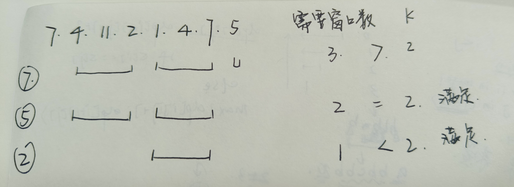
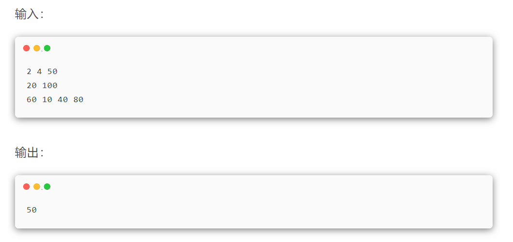

# 笔试真题

## 笔试真题


### 20240919 携程笔试

> 题3：有个n人组成的合唱团，第i个人的能力值为ai。现在将n个人排成一排，游游有k次训练的机会，让不超过l个连续的人能力变为任意值。如果合唱团的实力是所有人能力值的最小值。你可以帮助游游求出合唱团的实力的最大值是多少吗?
>
>   第一行三个整数n，k，l，表示人数，训练次数，每次训练的最大长度。(2 <= n <= 10^5, 1 <= k * l < n) 第二行n个整数ai，表示第i个人的能力值为ai(1 <= ai <= 1e9)


（7 4 11 2 1 4 7 5，上图有误）

以示例为例，输出的答案在4-11之间。

**暴力做法 -> $O(n^2)$**：直接遍历每个答案，比如遍历到7，遇到比7小的数字就用窗口覆盖它，需要的最少窗口数是3，超过了上限k。在符合要求的答案中找最大的数字。

**二分法 -> $O(nlogn)$**：当数组长度很长，可以用二分法优化。当遇到7不满足，说明7以上的数字更不可能满足，二分比7小的一半；当遇到2满足，说明2以下的数字都满足，以上的数字有可能满足，二分比2大的一半。



>题4：游游所在公司有n名员工，这n名员工的初始位置在a[i]，办公室的位置在p。有k个通行证，这k个通行证的位置在b[i]，每个位置有且只有一个通行证。这个位置的通行证如果被拿走了，这里就没有通行证了，其他员工无法在这个位置拿到通行证了。员工上班之前必须拿到通行证，每个通行证只能供一个人使用，一个位置上最多只有一个通行证。员工的初始位置可能和通行证的初始位置相同。每名员工必须有通行证才能进办公室(员工先要去列拿到通行证，然后再去办公室地点p)，员工移动1单位距离需要花费一单位时间。
>
>请问这n个员工都达到办公室的最短时间是多少。




可以看出这n个员工拿的n个通行证一定是连续的，否则答案会变差，因此，对员工和通行证排序，然后双重遍历即可。

```cpp
#include <bits/stdc++.h>
using namespace std;
#define ll long long
int main() {
    int n, k, p;
    cin >> n >> k >> p;
    vector<int> a(n), b(k);

    for (int i = 0; i < n; i++) {
        cin >> a[i];
    }

    for (int i = 0; i < k; i++) {
        cin >> b[i];
    }

    sort(a.begin(), a.end());
    sort(b.begin(), b.end());

    ll ans = 1e18;
    for (int i = 0; i + n - 1 < k; i++) {
        ll cur = 0;
        for (int j = 0, r = i; j < n; j++, r++) {
            int person = a[j];
            int card = b[r];
            cur = max(cur, 0LL + abs(person - card) + abs(card - p));
        }
        ans = min(ans, cur);
    }

    cout << ans << "\n";
}
```


### 20240913 饿了么笔试

> 题2：$x^p=y^q$, 现有四个数a,b,c,d按照任意顺序填入x,y,p,q中，问是否存在一个顺序满足等式相等。

可能的顺序有$A^4_4/2=12$种（等式左边和右边位置等价）

两边取log，$plogx=qlogy$，==log的运算比幂运算快==

> 题3：图G，逐个给节点涂色，同一个色作为一块，输出最大块的节点个数。


### 20240908 PDD笔试

> 题1：一个字符串由A、B字符组成，找出最长子串其AB数量相等，输出子串长度

将A视作+1，B视作-1，求==和为0的最长连续子数组长度==。

固定和的子数组 -> 前缀和

`这种成对的元素可以考虑转化成+-1的数字处理`

> 题2：向数组中任意位置插入子数组（可以为空）的和，插入k次，让数组整体和最大。

找最大子数组和x，并将这个和x插入到子数组中，再将2x插入，再将4x插入......

- 最大子数组和x用贪心的方法做，插入的总和用等比数列公式计算。

- 最终答案是$x*(2^k-1)+sum(a)$，其中指数取模运算可以用函数`pow(2,k,mod)`
- 只能过80%可能是取模后负数相加，可以把ans+10000*mod


### 20240904 华为笔试

> 题3：维修工要给n个客户更换设备，为每个用户更换一个设备。维修工背包内最多装k个设备，如果背包里有设备可以直接前往下一个客户更换或回公司补充设备，没有则需要回公司取设备。这些客户有优先级，维修工需要按照优先级给客户更换设备，优先级level用数字表示，数字小的优先级高。维修工从公司出发，给n个客户更换设备，最后再返回公司。请计算维修工完成这项工作所需要经历的最短总距离是多少。维修工可以走斜线。
>
>   第一行两个正整数 n,k(1≤k≤n≤2000),表示客户数和维修工背包容量。第二行两个正整数 x,y ，用空格分隔(1 ≤ ,y ≤ 10^6),表示公司的坐标
> 接下来n行每行三个正整数 xi,yi,leveli;，用空格分隔(1≤xi,yi≤10^6,1≤leveli<=n).(xi,yi)表示第i个客户的位置坐标，leveli表示第i个客户的优先级，保证所有客户优先级不同，客户和公司坐标不会重叠。


**状态机dp**


### 20240828 得物笔试

> 题3：一开始s串为空，想变成t，有四种操作：在s开头添加一个字符，花费p；在s末尾添加一个字符，花费p；在s开头添加s的子串，花费q；在s末尾添加s的子串，花费q。求最小花费

区间dp

1，考虑仅添加一个字符串：$dp[i][j]=min(dp[i][j-1],dp[i+1][j])+p$

2，考虑在开头添加子串：$dp[i][j]=min(dp[k+1][j]\ if\ s[i:k+1]\ in\ s[k+1:j+1]\ for\ k\ in\ range(i,j))$

3，考虑在末尾添加子串：$dp[i][j]=min(dp[i][k]\ if\ s[k+1:j+1]\ in\ s[i:k+1]\ for\ k\ in\ range(i,j))$


### 20240824 美团笔试

https://www.xiaohongshu.com/explore/66c97dfe000000001f01dd15?xsec_token=ABAqS0E2lnA-Lt8Wykriv4t4s4R8E-HvXqwODaaXS7lG8=&xsec_source=pc_user

> 题4：

